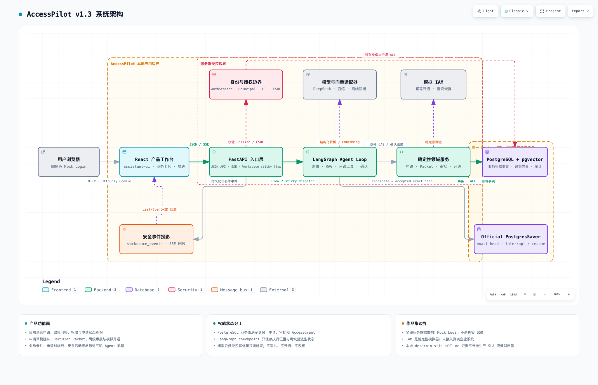
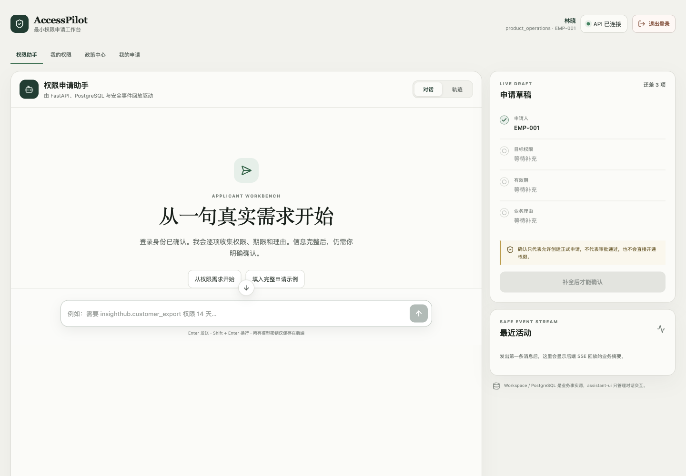
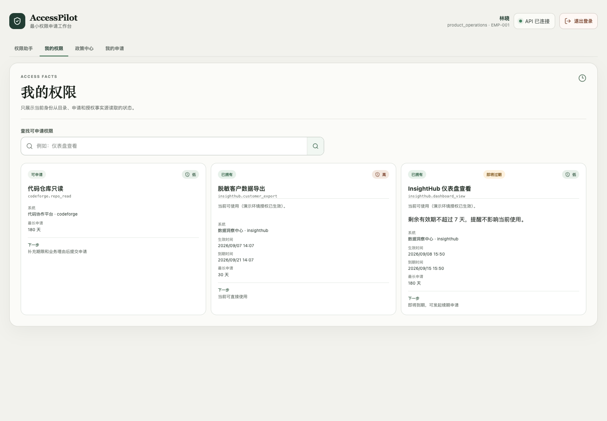
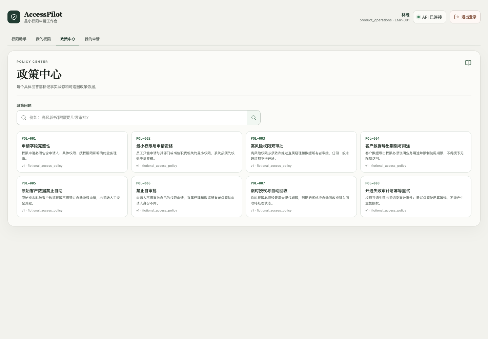
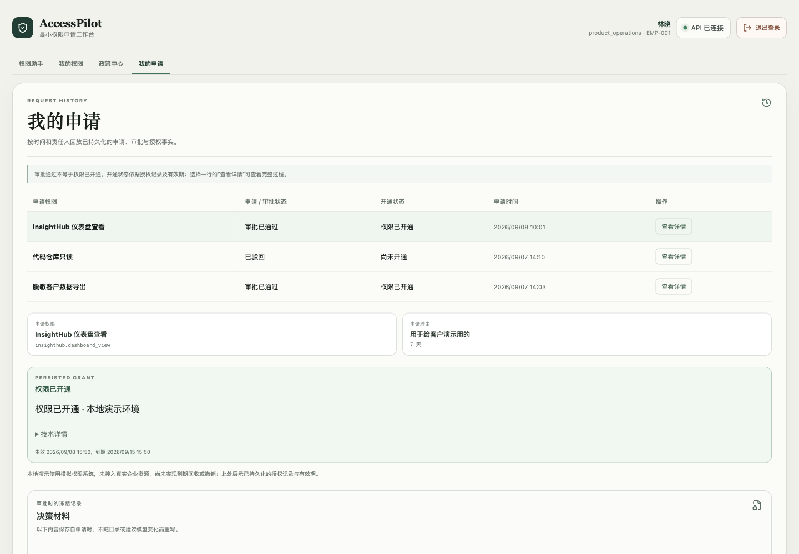

# AccessPilot

**用自然语言发起权限申请，让审批、开通与每一步依据都可追溯。**

[项目介绍](#1-项目介绍) · [系统架构](#2-系统架构) · [项目截图](#3-项目截图) · [解决的问题](#4-解决的问题)

## 1. 项目介绍

AccessPilot 是一个企业权限申请场景的 AI Agent 全栈演示项目。员工可以先问“我能申请什么权限”，再通过对话补充权限、使用期限和业务理由。系统将需求整理为结构化申请，生成审批材料，交给对应负责人审批，最后由权限管理员执行开通。

项目覆盖申请人、直属经理、数据负责人、权限管理员四种角色，演示一份申请从提出到授权落地的完整过程。

> 当前产品版本为 v1.3。所有员工、系统、权限与政策均为虚构数据；登录使用 Mock Login，权限开通连接模拟 IAM，未接入真实企业系统。

### 主要功能

| 功能 | 可以做什么 |
| --- | --- |
| 对话式权限申请 | 结合当前可申请目录与会话上下文理解口语，逐项追问权限、期限和理由；支持修改草稿与明确确认。 |
| 权限目录与状态 | 查询可申请权限，查看已有授权及有效期；将“已拥有”与“即将过期”分别提示。 |
| 政策检索与问答 | 使用 RAG 检索政策，返回可追溯的条款编号，并区分有依据、证据不足和服务不可用。 |
| 冻结审批材料 | 汇总已验证事实、申请人陈述、政策依据和 AI 建议；保存申请时的材料，便于事后回查。 |
| 人工审批 | 按目录规则走经理审批或经理→数据负责人双审批，校验角色、审批顺序并禁止自审批。 |
| 权限开通与恢复 | 审批完成后由管理员显式开通；通过幂等键、失败重试和未知结果查询避免重复授权。 |
| 申请历史与审计 | 分别展示申请、审批和开通状态，查看责任人、时间线及授权记录。 |
| Agent 运行轨迹 | 查看每轮处理结果、模型调用尝试、后端工具执行和历史事件；支持 SSE 推送与断线回放。 |

一条典型业务流程：

**提出需求 → 补全草稿 → 明确确认并提交 → 冻结审批材料 → 人工审批 → 管理员开通 → 查看授权。**

AI 负责理解输入和提供建议。身份、申请资格、审批路线及授权结果由后端业务规则决定。

### 技术栈

| 层次 | 技术 | 主要用途 |
| --- | --- | --- |
| 前端 | React 19、TypeScript、Vite、assistant-ui | 对话界面、草稿卡片、审批工作台与运行轨迹 |
| API 与领域逻辑 | Python、FastAPI、Pydantic、SQLAlchemy | 接口校验、业务状态转换、事务和资源访问控制 |
| Agent 编排 | LangGraph、PostgresSaver | 图执行、持久化检查点、中断确认与恢复 |
| 模型与检索 | DeepSeek、百炼 Embedding、pgvector | 意图理解、字段提取、只读建议及政策向量检索 |
| 数据与通信 | PostgreSQL、HTTP JSON、SSE | 业务事实持久化、增量响应与事件回放 |
| 工程与验证 | Alembic、pytest、Vitest、Testing Library、Ruff、MyPy、ESLint | 数据库迁移、行为测试、类型和静态检查 |
| 本地运行 | Docker Compose、Nginx、pnpm | 服务编排、前端构建与反向代理 |

无模型密钥时可使用确定性离线适配器演练流程；口语语义理解与真实模型效果需要配置相应提供方。模型密钥仅在后端使用。

## 2. 系统架构

复用项目已有的 **Archify 系统架构图**，重点展示 LangGraph 执行路径、业务服务和持久化状态之间的分工。



- **交互层：** React 通过 JSON API 和 SSE 访问 FastAPI，展示对话、业务卡片与安全事件。
- **编排层：** 按 Workspace 绑定的执行版本进入 LangGraph 或保留的 Legacy 路径；规则先处理明确输入，模型辅助理解不确定的表达。
- **业务层：** 后端校验申请资格与确认状态，保存正式申请和审批材料，执行人工审批及幂等开通。
- **存储层：** PostgreSQL 业务表保存申请、审批与授权事实；PostgresSaver 保存图执行位置和恢复状态。检查点本身不具有授权效力。

正式审批和开通经受控业务 API 执行。模型与只读工具无法直接批准申请或创建授权。

进一步阅读：[业务流程](docs/architecture/access-flow.md) · [数据模型](docs/architecture/data-model-er.md) · [v1.3 编排规格](docs/specs/accesspilot-langgraph-agent-loop-v1.3.md)

## 3. 项目截图

以下截图于 **2026-09-08** 从本地运行的应用重新截取，展示现有虚构演示数据，未使用设计稿或组件测试页面替代。

### 权限助手

左侧以对话收集需求，右侧同步展示申请草稿和最近活动；补全字段后仍需用户明确确认。



### 我的权限

集中展示可申请和已拥有的权限、使用期限与到期提醒。



### 政策中心

浏览政策主题和条款编号，作为查询申请资格、审批要求与期限规则的入口。



### 我的申请

申请逐行排列，审批与开通状态独立展示。选择一条申请，可以继续查看授权记录、冻结材料和生命周期。



## 4. 解决的问题

| 场景中的问题 | 项目的处理方式 |
| --- | --- |
| 员工不知道权限编号，也不清楚需要补什么信息 | 从可申请目录出发，结合上下文理解需求，并用多轮追问收集结构化字段。存在歧义时继续澄清。 |
| 查询政策和正式申请混在一起，容易误触发操作 | 区分咨询、查询和申请意图；正式提交受字段校验与明确确认约束。 |
| 审批人要在聊天记录、政策和申请信息之间反复查找 | 将申请事实、条款、理由和 AI 建议整理为冻结材料，并标明来源与适用范围。 |
| 模型可能误解需求或给出不可靠建议 | 候选权限必须经过后端目录校验；AI 建议与业务事实分开，审批路线和授权不由模型决定。 |
| “审批通过”容易被误认为“权限已经可用” | 分开保存审批与开通状态，以实际授权记录及有效期判断是否已开通。 |
| 网络超时、重复点击或进程中断可能导致状态不清或重复执行 | 使用事务、幂等键、执行租约与检查点恢复；开通结果未知时查询原操作。 |
| 用户难以知道 Agent 做了什么、调用了几次模型 | 展示持久化的安全执行事件、调用尝试和工具结果，同时保留业务审计记录。 |

这些能力在虚构业务环境中实现和验证，尚无真实企业上线后的效率、成本或 SLA 数据。当前未实现真实 SSO、真实 IAM 接入和权限到期自动回收；政策中描述的回收要求不代表该能力已落地。

<details>
<summary>本地运行与更多文档</summary>

需要 Python 3.11+、Node.js 22+、pnpm 11 和 Docker Compose。先复制配置文件，并填写本地 PostgreSQL 连接信息；如需真实语义理解，再配置模型密钥。

```bash
cp .env.example .env
python3 -m venv .venv
source .venv/bin/activate
pip install -e '.[dev]'
pnpm install

docker compose up -d db
alembic upgrade head
./scripts/start-local.sh start
```

默认工作台：`http://127.0.0.1:5173`；API 文档：`http://127.0.0.1:8000/docs`。开发时保持这一 Origin，不要与 `localhost` 混用。`.env` 不应提交到 Git。

- [应用目录说明](apps/README.md)
- [文档索引](docs/README.md)
- [v1.3 基线验收](docs/evidence/accesspilot-v1.3-final-acceptance-2026-08-21.md)
- [对话与权限体验补充验收](docs/evidence/accesspilot-v1.3-experience-release-2026-09-08.md)

测试结果按对应记录中的代码版本与验证范围阅读。

</details>
