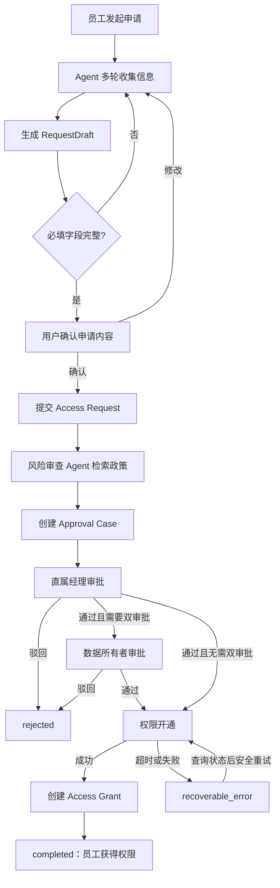

# AccessPilot 访问申请流程

## 黄金路径

## 阶段说明

| 阶段 | 业务含义 | 关键约束 |
| --- | --- | --- |
| `collecting` | Agent 收集申请信息 | 一次只追问必要的缺失字段 |
| `validating` | 校验字段和申请资格 | 未通过校验不得提交 |
| `awaiting_confirmation` | 等待申请人确认草稿 | 未确认不得调用提交工具 |
| `awaiting_approval` | 等待人工审批 | 高风险权限按顺序审批经理和数据所有者 |
| `provisioning` | 执行实际权限开通 | 使用幂等键，避免重复授权 |
| `completed` | 权限已经实际开通 | 必须存在 Access Grant |
| `rejected` | 任一级审批拒绝 | 不得进入权限开通 |
| `recoverable_error` | 工具或下游系统暂时失败 | 记录审计事件，允许安全恢复 |

## 关键边界

- 审批通过不等于权限已经开通。
- 风险审查 Agent 只读取申请和政策，不修改业务状态。
- 开通失败不能标记为 `completed`。
