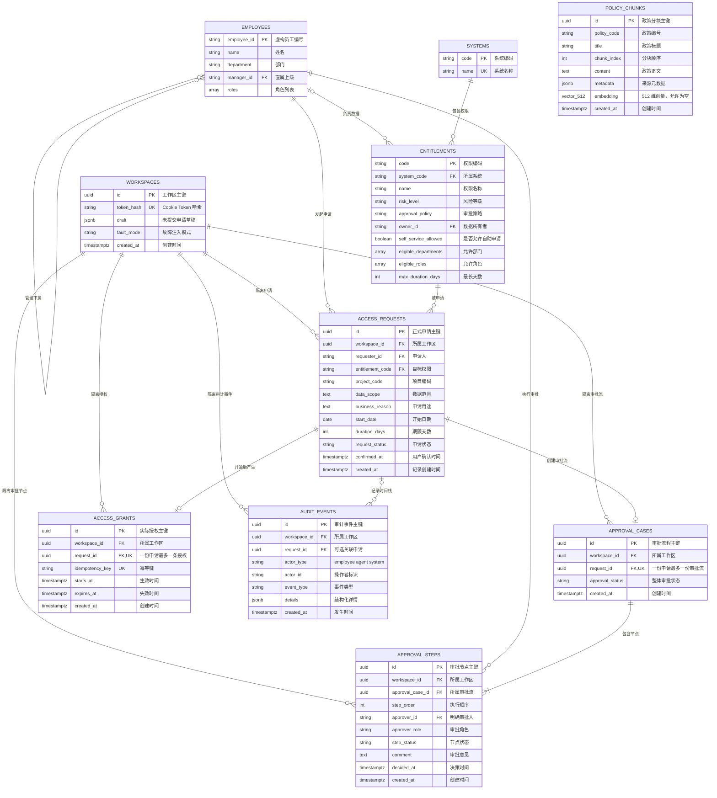

# AccessPilot 数据库 ER 图

## 如何阅读

ER 图用来表示“数据库有哪些表、每张表保存什么、表之间如何关联”。

- `PK`：主键，唯一识别一条记录。
- `FK`：外键，指向另一张表的记录。
- `UK`：唯一约束，防止重复数据。
- `||--o{`：一对零个或多个。
- `||--o|`：一对零个或一个。

## 完整关系图

`POLICY_CHUNKS` 故意不连接业务表：它是全局虚构政策知识库，风险审查 Agent 通过向量检索读取它，不用外键绑定某一份申请。

## 一笔申请如何穿过这些表

1. Agent 收集信息时，可修改的草稿保存在 `WORKSPACES.draft`。
2. 用户确认后，才生成不可随意修改的 `ACCESS_REQUESTS`。
3. 提交申请时创建一个 `APPROVAL_CASES`，再按策略创建一个或多个 `APPROVAL_STEPS`。
4. 所有必需审批节点通过后，IAM 模拟器尝试开通权限。
5. 只有 IAM 真正开通成功才创建 `ACCESS_GRANTS`；如果超时，只写入 `AUDIT_EVENTS`，不伪造授权记录。

## 必须记住的数据库约束

- `APPROVAL_CASES.request_id` 唯一：一份申请不能出现两条审批流。
- `(approval_case_id, step_order)` 唯一：同一审批流不能出现两个“第 1 步”。
- `ACCESS_GRANTS.request_id` 和 `idempotency_key` 唯一：重试不能重复授权。
- 业务子表同时校验 `workspace_id` 和父记录 ID：Workspace A 不能引用 Workspace B 的申请。
- `POLICY_CHUNKS.embedding` 允许为空，但检索时必须报可恢复错误，不得编造政策结论。
