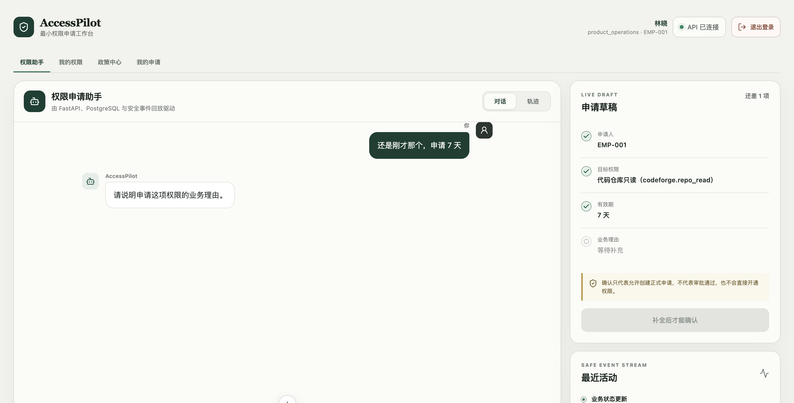

# 目录与上下文辅助的口语申请

状态：用户明确授权后，真实 Provider 五组场景验证通过；本地服务已保留数据重启，浏览器原句验证通过。没有提交、推送或部署。

## 本次目标

用户希望“那申请一下代码仓库的吧”能结合可申请目录理解为代码仓库只读，继续询问期限，而不是要求输入标准编码。多个合理候选应追问；目录外目标不可替换成相近的可申请权限。

## 已实现的范围

- DeepSeek 字段提取现在可以接收当前账号的可申请目录、本 Workspace 最近 6 条 user/assistant 消息（每条最多 1000 字符）以及当前草稿的权限目标。
- 上下文是一次调用的独立模型副本，底层 HTTP 客户端复用；不会修改应用共享模型上的会话状态。
- 历史消息作为数据供理解指代，已有凭证形状脱敏函数在传入前再次执行；不提供 Session Cookie、CSRF、数据库连接串或其他 Workspace 内容。
- 当前候选能唯一对应时允许模型返回目录中的 code；同系统多候选时要求保留共同系统名，交给已有解析器返回 ambiguous；无可靠对应时保留目标原词。
- 提示词明确禁止把“写权限”“原始数据”等目录外目标降级为相近可申请权限，禁止把历史期限、理由或确认当作本轮新字段输出。最终仍通过后端目录解析、资格校验和明确确认流程。
- Legacy 与 Flow 2 均接入同一个上下文构建函数。未更改 ParsedReply Schema、持久化结构、配额计数、审批或 Grant 创建规则。
- 规则路由补充“我需要…权限”“帮我开…权限”与受限指代续答。不是通用 LLM 意图分类器，也没有把权限目录改成向量检索。
- 无 Key 的 deterministic 提取器保持原行为；新增语义理解依赖已配置的 DeepSeek。

## 验证

1. 新增模型上下文调用测试先报缺失方法；“我需要客户数据导出权限”“帮我开一下代码仓库只读权限”路由测试先失败为 help。
2. 实现后 DeepSeek 适配器和路由测试 33 passed。
3. 含现有目录解析、Legacy 对话、Flow 2 JSON 的第一轮：83 passed；新增 6 条测试因测试辅助函数未查 Session ID 失败。修正辅助参数后，4 条用例暴露测试误把 draft=null 当对象；按现有 API 契约改为断言无草稿、revision=0，未改变生产行为。
4. 新增双引擎测试 + Flow 2 SSE + 崩溃恢复：28 passed、0 skipped。与前述 83 条通过用例不重复，共 111 条相关用例已通过。测试使用独立临时 PostgreSQL 库，脚本完成后清理。
5. 新增测试明确校验：其他 Workspace 的 canary 不进入模型上下文；无资格目录项不进入候选；凭证形状被脱敏；模型伪造 confirmed=true 不被采纳；目录外/歧义目标不生成草稿。
6. Ruff、MyPy（59 sources）与 git diff --check 通过。

离线测试里的模型响应是测试替身。它们证明上下文传递和后端边界，不能证明真实模型一定正确理解每种口语。

## 已授权的真实验证

用户回复“可以 你做验证吧”后，使用现有 DeepSeek 配置完成以下场景：

- 那申请一下代码仓库的吧
- 我需要客户数据导出权限
- 我想申请数据洞察中心的权限
- 申请代码仓库写权限
- 先查询可申请权限，再说“那申请一下代码仓库的吧”“还是刚才那个，申请 7 天”

同次发送当前账号可申请的虚构权限名称/编码/系统、当前 Workspace 最近的脱敏聊天、当前草稿权限目标。调用只创建演练会话与草稿，不提交正式申请或开通权限。

此前自动审批要求明确授权新增目录和聊天上下文外发；用户授权后才执行。结果见 [真实 API 结果](accesspilot-contextual-live-2026-09-07.json)。5 组共 7 次产品请求均 HTTP 200，其中目录查询是只读工具，其余调用真实 DeepSeek：

| 场景 | 实际结果 |
| --- | --- |
| 那申请一下代码仓库的吧 | collecting；codeforge.repo_read；追问期限 |
| 我需要客户数据导出权限 | collecting；insighthub.customer_export；追问期限 |
| 我想申请数据洞察中心的权限 | entitlement_ambiguous；列出导出与仪表盘两个候选；draft=null |
| 申请代码仓库写权限 | entitlement_no_match；没有替换成只读；draft=null |
| 查询目录 → 口语选择 → 还是刚才那个，申请 7 天 | 目标保持代码仓库只读，期限更新为 7，理由仍空，confirmed=false |

真实 Vite/FastAPI/SSE 浏览器另测原句，页面显示“请提供申请期限（天）”，草稿目标为“代码仓库只读（codeforge.repo_read）”。这些是本地样本，不代表所有自然语言表达都能稳定理解；当前网页仍使用 Legacy，Flow 2 接入证据来自前述自动化测试。

浏览器继续发送“还是刚才那个，申请 7 天”，目标保持不变、期限变为 7 天，助手追问业务理由；尚未确认或提交正式申请。

重启期间旧启动控制脚本两次 TERM 后仍残留；确认其 API/前端/数据库均已停止、无子进程后只结束该残留控制进程，再运行 start 模式恢复三项服务。没有重置或清空业务数据。启动脚本的停机问题未在本次语义改动中修复。
