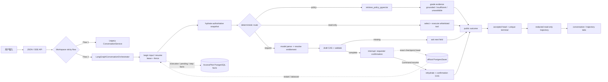

# AccessPilot v1.3 Interview Evidence Pack

**T42 状态：** `Verified`；独立验收修复轮 P0/P1/P2=0/0/0
**证据 revision：** `9e757fd433f10fbff22fba9654c54cc3b4e9bec2`
**产品状态：** `product_verified=true`
**面试状态：** `interview_ready=pending_user_verification`

这是可核验的讲解与 Demo 索引，不是发布说明，也不是候选人已通过无稿演练的记录。事实数字以 [Product Manifest](accesspilot-v1.3-product-manifest.md) 为准，六条反向链以 [Claim Ledger](accesspilot-v1.3-claim-ledger.md) 为准。所有人员、系统、政策、Case 和 Grant 都是虚构数据。

## 可核验的中文简历候选表述

> 以下只是候选文本；必须先完成后文的无稿演练和反向链复现，再由用户另行选择是否采用。它们不得自动写入正式简历。

1. 在本地作品集原型中，将 JSON/SSE 对话入口迁移为类型化 LangGraph 状态图，以真实节点和条件边承接确定性路由、政策 RAG、只读工具、申请收集与安全闭合，并用 33 个语义场景连续两轮验证 route/outcome/path 零差异。
   证据链：[CL-LG-01](accesspilot-v1.3-claim-ledger.md#cl-lg-01)、[CL-LG-04](accesspilot-v1.3-claim-ledger.md#cl-lg-04)。
2. 接入官方 PostgreSQL PostgresSaver，以 exact checkpoint head、lease/fence、CAS 和稳定 operation identity 支持申请人确认处的跨 App interrupt/resume；对六个精确崩溃窗口验证本地 quota、草稿、轨迹和终态不重复，同时保留外部调用可重试/重复计费的限制。
   证据链：[CL-LG-02](accesspilot-v1.3-claim-ledger.md#cl-lg-02)、[CL-LG-03](accesspilot-v1.3-claim-ledger.md#cl-lg-03)、[CL-LG-06](accesspilot-v1.3-claim-ledger.md#cl-lg-06)。
3. 将 pgvector 政策检索、只读工具与节点运行事实投影为脱敏最近三轮轨迹；在同一 T41 revision 完成 API `868 passed`、Web `109 passed`、fresh `101/101` cases、浏览器重启与 Legacy 回滚 `2/2`，并记录泄漏数 0 与未测指标。
   证据链：[CL-LG-05](accesspilot-v1.3-claim-ledger.md#cl-lg-05)；指标见 [Product Manifest](accesspilot-v1.3-product-manifest.md)。

## Agent Loop 讲解图

讲图时要主动指出四条线：

1. `Flow 2` 才进入 LangGraph，JSON/SSE 不能各自选引擎；
2. checkpoint 保存图恢复状态，AccessPilot PostgreSQL facts 仍是 pending、execution、身份和业务状态的权威源；
3. interrupt 只用于申请人确认，正式审批与开通仍由确定性服务和服务端 ACL 决定；
4. 轨迹来自持久化事件，只做脱敏展示，不暴露内部状态或开放操作。

## Demo 证据索引

| Demo 步骤 | 可观察结果 | 流程/运行证据 | 代码入口 |
|---|---|---|---|
| 1. grounded 政策问答 | 轨迹显示 `retrieve_policy_pgvector`，回答引用 POL-004 / POL-003 | [T41 §4](accesspilot-v1.3-t41-acceptance-2026-08-20.md)、[1440 Flow 2 轨迹](assets/accesspilot-v1.3-t41/flow2-trajectory-1440.png) | [production_graph.py](../../apps/api/src/accesspilot/agent/production_graph.py) 的 `_retrieve_policy_pgvector` |
| 2. 只读权限解析 | “客户数据导出”唯一解析为 `insighthub.customer_export`，不进 RAG | [T41 §4](accesspilot-v1.3-t41-acceptance-2026-08-20.md) | [production_graph.py](../../apps/api/src/accesspilot/agent/production_graph.py) 的 `_resolve_entitlement` |
| 3. 安全探测与可恢复错误 | 伪造 prompt/密码/思维链索取被拒绝；未知权限闭合后输入框仍可用 | [T41 §4](accesspilot-v1.3-t41-acceptance-2026-08-20.md)、[390 可恢复错误轨迹](assets/accesspilot-v1.3-t41/recoverable-error-trajectory-390.png) | [production_graph.py](../../apps/api/src/accesspilot/agent/production_graph.py) 的 `_compose_recoverable_answer` |
| 4. checkpoint 重启 | Flow 2 进入 pending，停 API，用原 DB/checkpoint 重启后键盘确认成功 | [T41 §4 重启步骤](accesspilot-v1.3-t41-acceptance-2026-08-20.md) | [turn_execution.py](../../apps/api/src/accesspilot/agent/turn_execution.py) 的 `begin_resume`；[json_orchestrator.py](../../apps/api/src/accesspilot/agent/json_orchestrator.py) 的 `_run_resume` |
| 5. 四角色 Case → Grant | EMP-001 申请，EMP-002/003 两级审批，EMP-004 模拟开通，申请人重登后读到同一 Grant | [T41 §4](accesspilot-v1.3-t41-acceptance-2026-08-20.md)、[1024 申请人 Grant 回读](assets/accesspilot-v1.3-t41/requester-grant-1024.png) | [approvals.py](../../apps/api/src/accesspilot/approvals.py)、[provisioning.py](../../apps/api/src/accesspilot/provisioning.py) |
| 6. Legacy 回滚 | active pending 先阻断，对账与 tombstone 后切 flow 1，旧/新 Workspace、Case/Grant 继续可读 | [T41 §5](accesspilot-v1.3-t41-acceptance-2026-08-20.md)、[rollback drill](../../apps/api/tests/db/test_t41_rollback_drill.py) | [rollback.py](../../apps/api/src/accesspilot/agent/rollback.py) 的 `LegacyRollbackBridge` |
| 7. 门禁与指标 | API 868、Web 109、parity 33×2、fresh 101 cases、event/side-effect/泄漏与 n=3 延迟样本 | [Product Manifest](accesspilot-v1.3-product-manifest.md)、[T41 §3–§6](accesspilot-v1.3-t41-acceptance-2026-08-20.md) | [verify-t41.sh](../../scripts/verify-t41.sh)、[run-t41-parity.py](../../scripts/run-t41-parity.py) |

## 90 秒讲解骨架

> AccessPilot 是一个本地作品集原型，用来验证“自然语言 Agent Loop 与确定性权限业务怎样分工”。Flow 2 的 JSON/SSE 都进入同一类型化 LangGraph，节点负责路由、政策 pgvector 检索、只读工具和申请收集；身份、审批和 Grant 仍由 PostgreSQL 领域服务决定。申请人确认处用官方 PostgresSaver interrupt/resume，并用 lease/fence、CAS 和稳定 operation 控制节点重放的本地副作用。运行事实经脱敏后只读展示最近三轮。T41 在同一本地 revision 重跑全门禁、两轮 parity、浏览器重启和 Legacy 回滚；这些证据不外推为企业部署或个人已掌握。

## 无稿演练与用户确认门禁

在用户手动更新任何正式简历之前，候选人需独立完成：

- [ ] 不看文稿，用 90 秒讲清图与业务权威源的分工；
- [ ] 走完 grounded RAG → 只读工具 → 申请收集 → 重启确认 → 四角色 Grant 主链；
- [ ] 从任一 Claim 反向指到产品入口符号、测试函数、T41 运行证据和一项限制；
- [ ] 说清“Provider 重试为什么不能由本地幂等自动变成精确一次”；
- [ ] 说清 checkpoint 与业务事实库、申请人确认与正式审批的差异；
- [ ] 不把 n=3 浏览器延迟小样本或 1/1 恢复外推为线上结论。

上述清单的勾选必须由用户本人在真实演练后记录；本文档不预填通过。

## 必须主动披露的边界

- 身份是 Mock Login，不是真实 SSO/OIDC/SAML；开通是模拟器，不是真实 IAM/IGA。
- 编排是服务端受控状态图，未实现 ReAct 或 Multi-Agent；模型不审批、不开通、不修改身份。
- Provider 与只读工具执行均为 at-least-once；`AFTER_TOOL_COMPLETION_BEFORE_EVENT` 恢复可重复工具调用，Provider 重试也可能重复调用/计费。只有本地 quota/草稿/step/head/轨迹/terminal 最多一次；没有 Token 成本或生产 SLA 证据。
- 没有 LangSmith/OpenTelemetry 可观测平台；页面轨迹是执行事实的白名单投影，不是思维链。
- 浏览器是 deterministic offline browser 小样本；`provider_token_latency`、`policy_recall_at_k`、`production_sla` 未测。
- strict serializer 警告、shutdown SIGINT 等待与 Vite single-chunk warning 仍是已披露边界，不得隐去。
