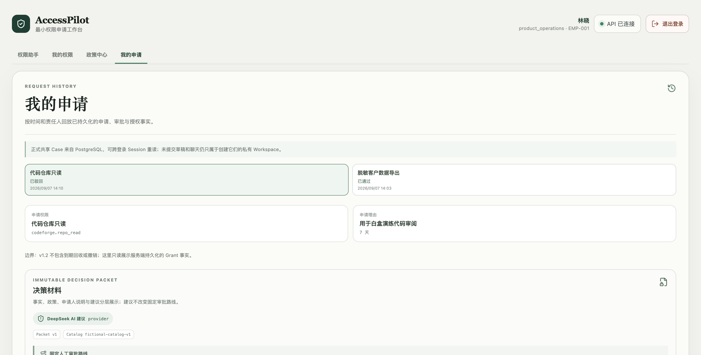

# 2026-09-07 全流程实测

本轮目标：在现有本地环境跑业务流程，为逐功能白盒学习提供真实样本。这里不替代 v1.3 发布验收，也不证明用户已掌握项目。

## 环境与改动

- 真实浏览器 ego lite → Vite `127.0.0.1:5173` → FastAPI `8000` → 本地 PostgreSQL。
- 页面实际轨迹为 `Legacy · ConversationService`，不是 Flow 2。决策材料实际标记 `provider`，返回 DeepSeek 建议；IAM 是 `iam-simulator`。
- 保留原有数据、原有未提交改动。新增两份虚构业务申请，其中一份开通、一份驳回。
- 本轮生产代码只改 `apps/web/src/api.ts`，回归测试在 `apps/web/src/auth.test.ts`。没有 commit、push、merge、deploy。

## CSRF 修复证据

1. 页面 A 查询成功。
2. 同一浏览器会话打开页面 B，恢复登录调用 `GET /api/auth/session`，服务端轮换 CSRF。
3. 回到 A 发送相同查询，出现与用户截图一致的 `CSRF 校验失败`。
4. 添加普通 JSON 写请求与 SSE POST 两个回归测试，均因仍发送旧内存令牌失败。
5. 最小修复：发送写请求时优先读取可读 `accesspilot_csrf` Cookie；响应内存值仅作无 Cookie 时的回退。没有改变服务端 Origin/CSRF 校验，没有自动重发业务写操作。
6. 两页面场景重新运行，A 在 B 刷新后查询成功。

这证明该路径可导致截图中的现象；不能反推用户截图一定由相同操作序列触发。

## 浏览器与 API 结果

| 功能 | 本轮观察 |
| --- | --- |
| Mock 登录/退出、四角色切换 | 成功；新 Session 的聊天/草稿为空，正式 Case 可按身份跨 Session 回读 |
| 可申请权限、我的权限 | 初始 3 项可申请；开通后客户导出显示已拥有、到期日 2026-09-21 |
| 中文名称解析 | “我的权限”中搜索“客户数据导出”唯一匹配 `insighthub.customer_export` |
| 政策目录/问答 | 8 条政策；客户导出问答为 grounded，列出 POL-004/003/005/008 |
| 多轮草稿 | 精确权限代码 → 追问期限 → 输入 `14` → 追问理由 → 等待确认 |
| 刷新恢复 | 草稿字段、确认待办、聊天历史恢复 |
| 明确确认、正式提交、冻结材料 | 分步成功；provider 建议与固定审批路线同时展示 |
| 启动审批 | 第二份申请通过滚动到可见按钮后点击成功。第一份首次点击未生效，随后用同一产品 API 成功启动；不据首次自动化点击认定产品 Bug |
| 高风险两级审批 | EMP-002 → EMP-003 顺序成功；审批完成后仍无 Grant |
| 管理员开通 | EMP-004 页面操作成功，1 次尝试、1 个 Grant |
| 幂等开通 | 再次调用同一申请的 provision API，HTTP 200，返回原 Grant，尝试次数仍为 1 |
| 低风险单级驳回 | 仅经理路线；未填理由时未发生驳回，填写理由后 rejected，未开通、无 Grant |
| 安全拒绝 | 索取 system prompt/隐藏推理被拒绝，输入框可继续工作 |
| 最近三轮轨迹 | 能读取持久化执行事实；当前显示 Legacy、安全路由及终态 |
| 申请时间线/授权回读 | 重新登录申请人后，页面能读到两份 Case、Packet、审批步骤和 Grant |

## 可复查样本

成功样本：

- Request：`aea58ada-65b1-4c43-9fd5-fa867a0c782d`
- Packet：`e4a2d9bc-958c-4269-ab95-5b2edfef8194`
- ApprovalCase：`6f7682fb-5bbc-4dbb-adca-defd0f8bc464`，两步 approved。
- Grant：`60521bf0-ccb6-4397-8248-1228eb3b8c05`
- 生效 `2026-09-07T06:07:56Z`，到期 `2026-09-21T06:07:56Z`。
- 审计顺序：request.submitted → decision_packet.created → approval.started → 两次 approval.step.approved → provisioning.started → provisioning.succeeded。

驳回样本：Request `db6315b8-9388-4db4-9437-88587ef361b3`，ApprovalCase `c106ad5d-8714-4096-8edd-b7ccfcc095a3`，经理 rejected，provisioning not_started，grant_id=null。

两份 Request 原始 `request_status` 都仍是 `submitted`；最终业务结果来自独立的 approval/provisioning 字段。教学时不要把 Request 单一字段误当整个生命周期。

## 实测发现与保留问题

1. **聊天与页面的跨 Session 查询不一致。** 同一申请人重新登录，“我的申请状态”回答没有正式申请，而“我的申请”页面展示已开通 Case。`tools/catalog.py:get_latest_request_status` 同时筛选 Workspace 与 requester；页面按 Principal 读取正式共享 Case。本轮已定位，未修改此已有改动文件。
2. **自然语言入口不够稳定。** “我需要客户数据导出权限”返回帮助；“我要申请客户数据导出权限”进入申请但未匹配；精确代码成功。独立名称解析页面同一中文名称成功。尚未将问题完全定位到模型提取或别名解析，不作为已修复问题。
3. **AI 建议存在事实偏差。** 低风险代码只读样本的建议声称缺少权限名称与身份，并引用客户导出/高风险政策；页面已验证事实中实际有权限和申请人。建议没有改变单级经理路线，但不能据 `provider` 标签认定建议质量通过。
4. 当前轨迹显示 Legacy。Flow 2、checkpoint、lease/fence 不应作为这次现有页面流程的实测结论。

## 自动化检查

- 前端：新增用例先红，随后 6 个相关测试文件 **37 passed**；TypeScript app/node 与 Vite 构建通过；ESLint 通过；构建保留大于 500 kB 的 chunk 提示。
- 后端：使用仓库 `run-t41-api-suite.py` 建立独立临时数据库，迁移后跑以下选择器，**42 passed / 0 skipped**，临时库已由脚本清理。结果见 [api.xml](api.xml)。
  - `api/test_t19_auth.py`
  - `api/test_t22_approval_lifecycle.py`
  - `api/test_t23_admin_provisioning.py`
  - `provisioning/test_service.py`
  - `agent/test_t37_recovery.py`
- 上述测试覆盖错误 Origin/CSRF、审批角色/顺序/驳回约束、开通失败使用原键重试、unknown 查询恢复、并发唯一 Grant、图执行崩溃恢复等。它们是自动化测试，不是本轮浏览器故障注入。
- 未执行现有服务重启/Legacy 回滚、全量 API、全量 parity、全量产品 eval 或线上验证。未改动运行服务的 flow 配置。
- 到期自动回收、撤销、真实 SSO、真实 IAM 都不属于当前可演示实现。
