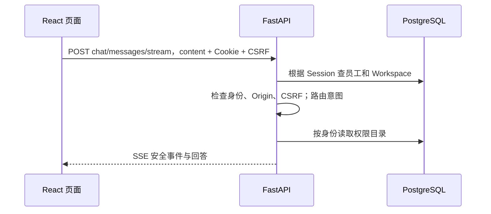

# AccessPilot：从页面走到数据，再回到页面

本次起点是 [2026-09-07 实测记录](../evidence/accesspilot-whitebox-2026-09-07/README.md)。已有真实样本可查，不用凭截图猜实现。先理解业务输入、输出和 API 合同，再追函数；不从 Python 基础或整份框架源码开始。

## 全部功能的学习顺序

| 站点 | 你实际操作什么 | 这一站要说清楚什么 | 优先读的代码 |
| --- | --- | --- | --- |
| 1 身份与请求入口 | 登录 EMP-001，问“我能申请什么权限” | 身份从哪里来；为什么 body 不传 employee_id；CSRF 为什么会挡住请求 | 前端 `api.ts`；后端 `auth.py`；`main.py` 鉴权中间件 |
| 2 权限事实与名称解析 | 打开我的权限，搜索“客户数据导出” | 可申请不等于已拥有；中文名称如何对应稳定权限代码 | `access_overview.py`；`tools/catalog.py`；`tools/executor.py` |
| 3 政策与证据 | 打开政策中心，问客户导出审批/期限 | 目录、检索结果、回答引用有什么区别；grounded 能证明什么 | `rag/policies.py`；`tools/policies.py`；`agent/embeddings.py` |
| 4 多轮草稿 | 申请精确权限代码，分别输入期限和理由 | 一句话如何变成结构化字段；`14` 为何能接上上一轮；修改为什么会使确认失效 | `conversation.py`；`workspaces.py`；`agent/routing.py`；`agent/deepseek.py` |
| 5 确认与正式申请 | 确认内容 → 提交正式申请 → 查看材料 → 启动审批 | 草稿、Request、Packet、ApprovalCase 是四种不同对象；AI 建议没有批准权 | `WorkbenchRuntime.tsx`；`decision_packets.py`；`approvals.py` |
| 6 人工审批 | EMP-002 经理，再 EMP-003 数据负责人；另演示经理驳回 | 为什么不能越级、自批、重复决定；低风险为什么只有经理一步 | `approvals.py`；`OperationsConsole.tsx`；API `decisions` 路由 |
| 7 权限开通 | EMP-004 执行，EMP-001 重登查看 | approved 不等于 succeeded；Grant 是什么；幂等键与 unknown 如何配合 | `provisioning.py`；`operations.py`；API `provision/recover` 路由 |
| 8 事件与恢复 | 轨迹、刷新、断线恢复；再单独演练 Flow 2 | SSE 传什么；业务事实与 checkpoint 的边界；哪些重试可能重复调用模型 | `api.ts` SSE parser；`AgentTrajectory.tsx`；`agent/production_graph.py`；`agent/turn_execution.py` |

表中 Python 路径相对 `apps/api/src/accesspilot/`，前端组件相对 `apps/web/src/`。每次只追当前功能相关入口。

## 第一站：先搞清“我”是谁

打开 `http://127.0.0.1:5173`，刷新以加载本轮 CSRF 修复，选择 EMP-001。

1. 在浏览器开发者工具 Network 中观察登录：`POST /api/auth/login`，body 为 `{"account_id":"EMP-001"}`。这是 Mock 登录；服务端查虚构员工并创建 Session。
2. 浏览器保存 HttpOnly Session Cookie。之后访问业务 API 时自动携带它；前端不能凭一句“我是管理员”修改身份。
3. 后端把 Session 对应到员工与 Workspace。员工决定业务身份，Workspace 隔离当前会话的聊天和草稿。
4. 发送“我能申请什么权限”。页面调用 `POST /api/chat/messages/stream`，body 是 `{"content":"我能申请什么权限"}`，Cookie 与 `X-CSRF-Token` 在请求头链路中传递。
5. 后端先检查登录、Origin、CSRF，再进入确定性意图路由和只读权限目录工具。当前运行是 Legacy；不能把这个入口直接叫作 LangGraph。
6. 后端以 SSE 返回安全事件和回答，界面显示结果。这一步不创建正式 Request，更不会创建 Grant。

可以把这条链自己画成：

这一站的小练习：先预测“我能申请”与“我已经拥有”的答案是否相同，再打开“我的权限”核对。现在演练账号已拥有客户导出权限，而另外两项仍可申请。不要在笔记里抄 Cookie/CSRF 值。

**能说明下面三件事才进入下一站：** 身份不是从聊天文字来的；CSRF 失败发生在业务处理之前；可申请资格与有效 Grant 是不同事实。

## 主链操作脚本

需要亲手重新申请时，可选择尚未拥有的仪表盘权限；下面保留本轮高风险主链作为可复查样本，不要求重复创建同一授权。

1. EMP-001：`申请 insighthub.customer_export 权限` → `14` → `用于虚构客户留存分析`。
2. 看清四项字段，明确确认；再点击“提交正式申请”。
3. 等决策材料冻结，核对 verified_fact / user_claim / policy_evidence / advisory 四类来源。
4. 滚动到草稿卡的“启动审批”按钮并点击，看到待经理审批再切账号。
5. EMP-002：打开审批工作台，核对申请、固定路线和理由，批准当前步骤。
6. EMP-003：核对同一张 Case，批准数据负责人步骤。
7. EMP-004：打开审批工作台，执行权限开通。看到 Grant 才算开通。
8. EMP-001：重新登录，在“我的权限”和“我的申请”核对 Grant、到期时间、两级审批和审计。

本轮另有代码只读申请的驳回样本。驳回终止审批，不会生成 Grant。到期回收/撤销还没有产品实现。

## 学习时要保留的真实问题

- 当前聊天的“我的申请状态”还按 Workspace 查，跨登录可能说没有申请；以“我的申请”页面的共享 Case 事实核对，并追 `get_latest_request_status` 的 SQL。
- 当前两种中文申请表达曾失败，精确代码成功。把路由、字段提取、名称解析拆开观察，不把所有失败都笼统归给模型。
- provider 建议也可能错：本轮低风险建议说缺少身份/权限，旁边 verified_fact 却已有这些字段。固定目录路线仍只有经理一级。这是学习“建议不能授权”的真实案例。
- 本轮页面是 Legacy；LangGraph 的 `hydrate → route → tool/parse → validate → interrupt/resume → terminal` 应在明确启动 Flow 2 的独立演练中学习。本轮已有 3 条图恢复自动化测试通过，但未重启当前页面服务验证 checkpoint。

之后每站由你先操作和预测，我再带你定位 API、对应函数、数据库读写和失败分支。你的无稿演练结果由你实际完成后确认，不预先标记掌握。
