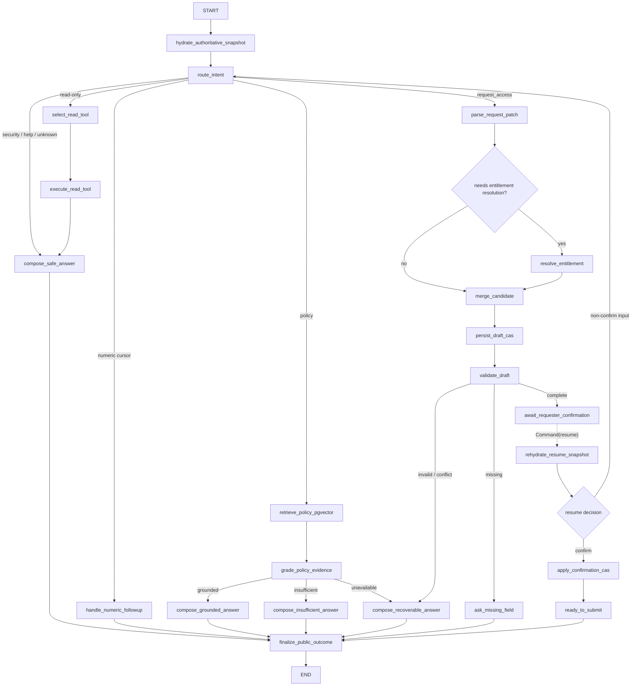

# AccessPilot v1.3「真实 LangGraph Agent Loop 与只读运行轨迹」Spec

**状态：** T26–T39 `Verified`；T40–T42 尚未开始；用户已授权 T39 仅本地提交，T38 已本地提交 `0aa953c`，未授权推送、合并、部署或修改正式简历
**更新时间：** 2026-08-20
**继承基线：** AccessPilot v1.2，`product_verified=true`；历史验证结果不能自动证明 v1.3
**上游规格：** `docs/specs/accesspilot-productized-agent-v1.2.md`
**参考实现：** `deepseek-ai/deepseek-harness` 的只读轨迹体验；不复制其内部协议或调试器复杂度
**交叉评审：** `docs/reviews/accesspilot-v1.3-spec-claude-review-2026-08-16.md`、`docs/reviews/accesspilot-v1.3-spec-deepseek-review-2026-08-16.md`
**评审裁决：** `docs/reviews/accesspilot-v1.3-spec-review-decisions-2026-08-16.md`

## 0. 决策摘要

v1.3 不把 LangGraph 当作轨迹图标签，而是让它真实承接 AccessPilot 的自然语言 Agent Loop：意图分流、申请字段理解、只读工具、政策 RAG、草稿校验、错误闭合和申请人确认。

本版本采用以下决定：

1. FastAPI 的真实 JSON 与 SSE 聊天入口最终都必须调用生产 `CompiledStateGraph`；单独测试中的教学图不算接入。
2. 现有 PostgreSQL 业务表继续是身份、草稿、正式申请、审批和开通的唯一权威源；LangGraph checkpoint 只保存执行位置和可恢复的派生状态。
3. P0 包含 PostgreSQL checkpointer 和一次有业务意义的 `interrupt/resume`：申请字段完整后等待申请人明确确认。
4. 经理审批、数据负责人审批和 IAM 开通不改造成 LangGraph interrupt，也不成为模型工具；它们继续使用确定性领域状态机、ACL、事务和幂等键。
5. 页面顶部提供“对话 / 轨迹”切换；轨迹只读展示真实节点、路由、模型结构化解析、RAG、只读工具、安全结果和终态。
6. 不展示 Chain of Thought、隐藏推理、系统提示词、checkpoint 原文、完整工具参数、原始 Provider 响应、SQL、凭证或配额。
7. v1.3 不删除 Legacy `ConversationService`；引擎绑定属于 Workspace，而不属于 JSON/SSE 入口。同一 Workspace 的两个入口始终解析到同一引擎，避免 pending graph run 被另一入口送入 Legacy。
8. 同一 Workspace/`agent_thread_id` 的 invoke/resume 使用应用自有 turn execution ledger、可续租约与单调 fence 串行化；重复并发请求稳定返回 409，失效 executor 不能提交业务写入、新 checkpoint head 或终态。
9. 一次业务输入只能对应一次图调用。待确认时的非确认消息通过同一次 `Command(resume=...)` 在图内 rehydrate 后重新路由，不允许“先关闭旧 interrupt、再启动第二次 invoke”的丢消息窗口。

## 1. 现状与问题

### 1.1 当前真实状态

- T26 已将 LangGraph/PostgresSaver/psycopg 候选矩阵锁定并在隔离 PostgreSQL 中验证，但生产入口尚未调用它；
- `apps/api/src/accesspilot/agent/graph.py` 只有 `START → ask_question → END` 的单节点教学图；
- 该图只在 `apps/api/tests/agent/test_graph.py` 中调用，checkpointer 也是进程内 `InMemorySaver`；
- 生产 `/api/chat/messages` 与 `/api/chat/messages/stream` 已通过默认 `LegacyConversationOrchestrator` 调用 Legacy 实现，尚未进入 LangGraph；
- 当前政策问答已经真实使用 `PolicyService + pgvector`，权限目录解析不是 RAG；
- 当前 SSE 中的 `tool.started/tool.completed` 是根据执行后的 `tool.summary` 事后合成，不能证明真实工具边界或耗时；
- 前端轨迹原型已经能安全回放现有事件，但必须在后端切流前诚实显示 Legacy 引擎。

因此，v1.2 最多能声明“有 LangGraph 最小 PoC”，不能声明“基于 LangGraph 编排生产 Agent 工作流”。

### 1.2 为什么现在值得迁移

第一版用过程式编排验证业务闭环是合理的；随着以下需求出现，显式状态图开始产生真实价值：

- 意图、RAG、工具、安全拒绝、数字 Cursor 和申请收集分支持续增长；
- 需要在人类确认处持久暂停，并在进程重启后恢复；
- 需要按真实节点生成可解释轨迹，而不是由前端猜测内部步骤；
- 需要对节点重试、崩溃恢复和副作用幂等做独立验证；
- 需要让简历中的 LangGraph 能被代码入口、checkpoint、故障测试和页面轨迹共同证明。

## 2. 目标、完成定义与非目标

### 2.1 P0 目标

1. 用类型化 StateGraph 替换生产 Agent Loop 的过程式分支，同时保持 v1.2 对外 DTO、SSE 和业务结果兼容；
2. 用 PostgreSQL checkpointer 支持申请人确认处的持久化 `interrupt/resume`；
3. 让 Router、模型解析、RAG、只读工具、草稿 CAS 和终态产生真实、脱敏、可去重的轨迹事件；
4. 在工作台顶部以只读方式切换对话与最近三轮轨迹，并展示真实运行引擎；
5. 通过 parity、重启恢复、故障注入、安全泄漏扫描和浏览器主链形成新 revision 的简历证据。

### 2.2 完成定义

只有以下条件全部成立，才可以把项目写成“LangGraph 驱动的生产 Agent Loop”：

- 真实 API 入口调用生产图，且有端到端路径测试；
- 图节点和条件边承担真实职责，不是把整个旧服务包装成一个节点；
- PostgreSQL checkpointer 能跨 App/进程实例恢复 interrupt；
- 业务写入在节点重放后不重复，外部模型调用的 at-least-once 边界被诚实记录；
- 轨迹中的引擎、节点、RAG 与工具均来自真实事件；
- 新 revision 的完整质量门禁和固定评测重新通过；
- Legacy 回滚演练通过。

### 2.3 非目标

v1.3 明确不实现：

- ReAct 自主循环或让模型自由选择任意工具；
- Multi-Agent 或 Supervisor/Worker 编排；
- 混合检索、重排、Query Rewrite 或新的向量模型；
- 把经理/数据负责人审批包装成 LangGraph HITL；
- 把正式提交、审批决定或 IAM 开通交给模型或聊天图；
- LangSmith、OpenTelemetry、Prompt/模型版本平台或 Token 成本平台；
- 展示模型思维链、原始 checkpoint 或开发者 debug stream；
- 真实企业 SSO、真实 IAM、多租户 SLA 或生产规模声明。

上述能力未来若需要，必须以新的 Spec、测试和证据进入，不能因为接入 LangGraph 自动写入简历。

## 3. 用户体验

### 3.1 顶部视图切换

权限助手主面板标题区提供两个可键盘访问的 Tab：

- **对话：** 保持现有聊天、确认卡和流式反馈；
- **轨迹：** 展示当前轮与最近两轮 Agent Loop，最新一轮默认展开。

切换只改变展示，不发起 API 调用、不恢复 checkpoint、不执行工具、不提交申请。

### 3.2 单轮轨迹内容

每轮按真实事件顺序展示：

1. 用户输入；
2. `LangGraph · flow_version` 编排开始；
3. 确定性路由及选中的分支；
4. 若发生结构化解析，展示 `DeepSeek/Offline Parser`、尝试次数、状态和被识别的字段名；
5. 若发生政策检索，展示 `RAG · pgvector`、检索状态、命中数量和政策编号；
6. 若发生工具调用，展示只读工具名、开始、完成和安全结果摘要；
7. 草稿 revision、缺失字段和业务状态；
8. 等待/恢复申请人确认，或本轮最终输出；
9. 可恢复错误、中断或安全拒绝。

只有真实发生的步骤才展示。`resolve_entitlement`、目录列表和自审批政策读取不得标成 RAG；只有 `search_policies` 的 pgvector 路径显示 RAG。

### 3.3 安全详情

每个步骤允许展开“安全事件详情”，但只显示白名单字段。轨迹页固定说明：

> 这是执行事实的只读投影，不是模型思维链。

历史 Legacy 轮次显示 `Legacy · ConversationService` 或 `Unknown`，不得伪装成 LangGraph。

## 4. 权威状态与运行边界

| 数据 | 唯一权威源 | LangGraph checkpoint 中允许的内容 |
|---|---|---|
| Principal / 角色 / Session | `AuthSession → EmployeeRecord` | 只保存不可授权的内部引用；恢复时必须重新鉴权 |
| Workspace 草稿与 Cursor | 现有 Workspace 表、`draft_revision` 与 CAS | `base_revision`、已提交 revision、缺失字段等派生快照 |
| 正式 Request / Packet | 现有业务表 | 最多保存 ID 引用，不能修改状态 |
| Approval / Provisioning / Grant | 现有领域服务与审计表 | 不进入聊天图写工具 |
| RAG 证据 | `policy_chunks + pgvector` | 脱敏政策编号、状态和数量 |
| 已接受的运行位置 | PostgreSQL checkpointer 内容 + 应用自有 fenced checkpoint-head 指针 | 节点位置、分支、flow/schema version、安全派生状态；禁止隐式选择“最新行” |
| HTTP turn / 逻辑输入 / lease | 应用自有 `AgentTurnExecutionRecord` | 只保存运行引用，不作业务授权依据 |
| pending interrupt 公开投影 | 应用自有 `AgentPendingInputRecord` 与 Cursor；必须与已接受 checkpoint head 对账 | checkpoint 仍保存真实 interrupt task；投影只用于恢复、切流和 UI |
| 前端轨迹 | `workspace_events` | 不从 checkpoint 直接暴露 |

Graph State 或 checkpoint 绝不能成为第二套授权事实源。任何恢复节点都必须重新读取数据库权威状态并重新校验 Principal、Workspace 归属和 revision。Checkpointer 保存图状态，但运行时只能从 `AgentTurnExecutionRecord`/`AgentPendingInputRecord` 中记录的确切 `checkpoint_thread_id + checkpoint_ns + checkpoint_id` 继续；未被当前 fence 接纳的孤儿或过期 checkpoint 不得被“取最新”恢复。

## 5. 生产 StateGraph

### 5.1 拓扑



### 5.2 节点职责

- `hydrate_authoritative_snapshot`：从服务端 runtime context 获取当前 Principal 和 Workspace，重新读取草稿、Cursor、revision 与 quota；
- `route_intent`：复用确定性 Router 和 v1.2 的优先级，不用模型决定安全边界；
- `parse_request_patch`：调用现有结构化模型/离线解析器，只产生候选字段；身份、确认和目录编码由服务端覆盖或解析；
- `retrieve_policy_pgvector` / `grade_policy_evidence`：拆出真实 RAG 边界，保留现有 top-k、阈值和 grounded/insufficient/unavailable 三态；
- `execute_read_tool` / `resolve_entitlement` / `validate_draft`：只调用现有白名单服务，不允许 LLM 注入工具名；
- `persist_draft_cas` / `apply_confirmation_cas`：每次重新读取权威 revision，通过现有 CAS 服务写入；
- `await_requester_confirmation`：唯一 P0 动态 interrupt；该节点在调用 `interrupt()` 前不写数据库、不扣 quota、不调用模型/工具，也不创建正式申请。进入该节点前已经提交的草稿 CAS 与安全事件属于上游事实，不被回滚；
- `rehydrate_resume_snapshot`：每次 resume 后重新鉴权、重新读取权威草稿/Cursor/revision，并清除 checkpoint 中只属于上一输入的派生字段；
- `finalize_public_outcome`：生成现有 `ConversationTurn` 兼容输出，不直接创建正式申请。

### 5.3 类型化 State 与 Runtime Context

State 使用输入、内部、输出分离的 TypedDict/Pydantic Schema，最小字段为：

```text
schema_version, flow_version
workspace_ref, graph_run_id, input_seq, input_turn_id
safe_user_text, input_kind
intent, security_flagged, selected_route
base_draft_revision, committed_draft_revision
draft_patch, missing_fields, phase
tool_name, safe_tool_result
policy_status, policy_evidence_codes, policy_match_count
business_status, assistant_message
recoverable_error, pending_input_id, pending_input_kind
```

下列对象只通过 LangGraph runtime context 注入，不得序列化进 checkpoint：

```text
SessionFactory, WorkspaceService, PolicyService,
StructuredReplyModel, IntentRouter, Principal,
current_turn_id, Workspace token, Cookie, CSRF, API Key
```

禁止进入 checkpoint 的内容还包括：系统提示词、隐藏推理、原始异常、完整 Provider 响应、任意 SQL、向量、完整工具原始结果和未脱敏凭证。

Checkpoint 字段采用额外的字段级白名单：

- `draft_patch` 只允许已脱敏、已规范化且长度受限的 `entitlement_id`、`duration_days`、`justification`；不允许 employee/role/confirmed 或任意额外字段；
- `safe_tool_result` 只允许工具枚举、状态枚举、候选权限/政策编号、命中数量和受限摘要；不允许原始 query、政策正文、数据库行、向量或 Provider 响应；
- `safe_user_text` 必须先经过现有敏感内容清洗；resume 后不再需要的候选字段由后续 state update 清空，但历史 checkpoint 仍按统一保留期和访问控制处理；
- AC-03 对实际序列化后的 checkpoint bytes/values 做递归 key、值模式和类型扫描，而不只检查 Python 输入 DTO。

## 6. PostgreSQL Checkpoint 与人类确认

### 6.1 依赖与初始化

当前 `langgraph 0.6.11` 不能直接作为新持久化方案的基线。第一张实施 Ticket 先做隔离兼容性 spike，再锁定同一矩阵；当前候选基线为：

```text
langgraph==1.2.11
langgraph-checkpoint==4.2.0
langgraph-checkpoint-postgres==3.1.2
psycopg[binary]==3.3.4
psycopg-pool==3.3.1
LANGGRAPH_STRICT_MSGPACK=true
```

必须提交可复现的 Python 锁定/约束产物。只有 spike 在全新虚拟环境、Docker、strict msgpack、同步运行适配器和 PostgresSaver setup/resume 测试中全部通过后，候选矩阵才成为批准矩阵；若不可用，先回流本 Spec，不在 Ticket 内静默换版本。Spike 还必须证明：传入确切 `checkpoint_thread_id + checkpoint_ns + checkpoint_id` 时不会隐式选择另一 head；saver 在 `put` 后暴露的新 locator 只是 candidate，只有后续 writes 落盘、图停止且精确状态校验通过才能提升为 accepted head；interrupt 可从指定 accepted head 跨进程 resume。

Checkpointer 使用独立 PostgreSQL schema 和受限 runtime 账号。DDL 权威固定为：

- 官方 `langgraph-checkpoint-postgres` 的 `setup()`/内部迁移只负责 checkpoint schema 与表；不复制其建表 SQL 到 AccessPilot Alembic；
- AccessPilot Alembic 只负责 Workspace 的 thread/flow 字段、步骤幂等事实、事件 key 等应用自有表/列；Alembic no-drift 显式排除 checkpoint schema；
- 独立 checkpoint 初始化命令由 migration role 在部署时执行，顺序为“AccessPilot Alembic upgrade → checkpoint setup/migrate → readiness”；runtime role 无 DDL 权限，请求路径永不调用 `setup()`；
- Alembic downgrade 和紧急 Legacy 回滚都不删除、不降级 checkpoint schema；官方 checkpoint schema 升降级另走受控初始化流程；
- `setup()` 连续执行两次必须幂等；候选版本 spike 必须先证明自定义 schema/search path、`autocommit=True`、`dict_row` 和连接池配置真实可用。

### 6.2 Thread、Turn 与版本

- `agent_thread_id`：Workspace 表新增的服务端 UUID，唯一、非空、不可变；迁移为存量 Workspace 逐行生成并回填，新 Workspace 在创建事务中生成；客户端不能提交、读取或覆盖；
- `graph_run_id`：一次逻辑图运行的服务端 ID；遇到业务 interrupt 后跨 HTTP resume 保持不变；
- `checkpoint_thread_id`：每个 `graph_run_id` 唯一且不可变的服务端字符串，固定由 `accesspilot:<graph_version>:<graph_run_id>` 派生，作为 LangGraph/PostgresSaver 的 `configurable.thread_id`；不同 graph run 绝不共用，客户端不可见；`agent_thread_id` 仍只用于 Workspace 级并发与切流；
- `input_seq`：同一 `graph_run_id` 内的逻辑用户输入序号；在接受输入的应用事务中只分配一次，图节点和 checkpoint 重放都不得自增；
- `turn_id` / `input_turn_id`：第一次接受该逻辑输入的 JSON/SSE HTTP turn。崩溃接管继续复用原 `turn_id` 并为它提交唯一终态，不会为同一输入伪造新 turn；只有用户真正提交下一条输入才生成新 `turn_id`；
- `attempt`：同一 `(workspace_id, graph_run_id, input_seq)` 的服务端执行尝试号，从 1 开始；只有租约过期后的恢复接管才递增，不改变 `input_seq/input_turn_id` 或业务 operation identity；
- `lease_fence`：Workspace 级单调递增整数。每次新输入或过期接管由数据库分配新 fence，执行器不得自报；
- `flow_version`：Workspace 表中的服务端枚举。迁移后的存量 Workspace 为 `1`；只有满足 canary 条件的新 Workspace 才写 `2`；
- `schema_version`：约束 checkpoint state 的可兼容演进。

不得把前端传入的 thread/workspace/employee/role 字段用于 checkpoint 查询。每次 invoke/resume 前都按有效 AuthSession 重新解析 Workspace。

应用 schema 新增两类运行事实，具体表名可在 Ticket 中按现有命名习惯调整，但字段和不变量不得弱化：

- `AgentTurnExecutionRecord`：至少记录 `workspace_id, graph_run_id, checkpoint_thread_id, input_seq, input_turn_id, input_event_id, auth_session_ref, actor_id, engine, attempt, lease_fence, lease_expires_at, status, checkpoint_ns, accepted_checkpoint_id, terminal_event_id`；`(workspace_id, graph_run_id, input_seq)` 和 `input_turn_id` 唯一，同 Workspace 最多一条 `status=running`；status 只允许 `running | waiting_input | completed | recoverable_error | interrupted`，running 时 lease 非空且 terminal 为空，其他状态必须释放 lease 并引用唯一 terminal；v1.3 根图要求 `checkpoint_ns=''` 的 CHECK 约束；
- `AgentPendingInputRecord`：至少记录 `workspace_id, agent_thread_id, graph_run_id, checkpoint_thread_id, pending_input_id, kind, draft_revision, auth_session_ref, actor_id, engine, checkpoint_ns, accepted_checkpoint_id, status, resume_input_seq, retired_at, retirement_reason`；同 Workspace 最多一条 `active/resuming`，status 只允许 `active | resuming | resolved | abandoned_to_legacy | abandoned_conflict`。`abandoned_*` 行是不可变 retirement tombstone：保留原 run/checkpoint thread/namespace/head/kind 和原因，运行时永不再 resume，也不计入 live pending。`auth_session_ref` 只是服务端 AuthSession 数据库 UUID 外键，不是 bearer/cookie/CSRF；恢复时会话已过期/撤销或 actor 不匹配就只安全闭合，不继续副作用；v1.3 根图要求 `checkpoint_ns=''` 的 CHECK 约束。

LangGraph 根图不支持把任意业务前缀当作 `checkpoint_ns`：候选 1.2.11 会将根图写入归一到 `checkpoint_ns=""`，而 `get_state()` 会把非空 namespace 解读为子图路径。因此不同 graph run 通过独立 `checkpoint_thread_id` 隔离，而不是伪造 namespace。每次 `put` 返回的完整 locator `checkpoint_thread_id + checkpoint_ns + checkpoint_id` 只能先保存为调用内 candidate；它必须等后续 saver writes 落盘、图停止且精确状态校验通过后，才能在 fenced finalize 事务中提升为 accepted head。v1.3 根图 namespace 固定为空字符串，适配器对任何非空值 fail-fast。未来若引入真实嵌套子图，必须另立 Spec 定义 LangGraph 管理的 namespace 合同。用户输入被接受时，应用事务同时分配 `input_seq/turn_id/fence`、建立 execution record，并保存 `turn.started` 与经现有安全清洗的 `message.user` 事件；execution record 只保存 `input_event_id`，不再复制原始 prompt。崩溃恢复从该安全输入事实重建 runtime input。

### 6.3 确认 interrupt/resume

当申请字段完整且未确认时：

1. `await_requester_confirmation` 返回 JSON 可序列化的安全 interrupt：`pending_input_id`、`kind=confirmation`、`draft_revision`、摘要与允许决定；
2. PostgresSaver 对 dynamic interrupt 的实际顺序是先 `put` 图 head，再 `put_writes(__interrupt__)`；因此任何单次 `put` 返回的 locator 只是进程内 `candidate_head`，绝不得立即写成 accepted head。只有 invoke/stream 正常停在 interrupt 或 END、全部 saver 调用完成后，调用层才能用 `get_tuple(exact)` 和图状态校验该精确 locator 完整包含预期 interrupt/END；
3. 校验通过后，单个 fenced 应用事务必须同时：锁定 Workspace/execution，复核 `input_turn_id + lease_fence`；把完整 candidate locator 提升为 accepted head；写入/renew `AgentPendingInputRecord`；激活 `expected_field=confirmation` Cursor；写 `agent.input.required → business.status=awaiting_confirmation → message.completed` 唯一终态；把 execution 标为 `waiting_input/completed` 并释放 active lease。任一步失败整个事务回滚，不存在“accepted head 可见但 interrupt 尚未持久”或“有 terminal 但无 Cursor/pending 投影”窗口；
4. 如进程在 saver 已写部分/全部 candidate、但上述提升事务前崩溃，execution 仍是无 terminal 的 `running`，candidate 是不可恢复的孤儿。租约过期后 App B 接管同一 `(graph_run_id,input_seq,input_turn_id)` 并递增 `attempt/fence`：有上一个 accepted head 就只从该 head 继续，从未 accepted 才允许从安全 `input_event_id` 重建；本地副作用由 operation ledger 去重，不创建新 HTTP turn；
5. 用户下一条消息创建新 `turn_id`和新 `input_seq`，但使用同一 server-side `agent_thread_id/graph_run_id/checkpoint_thread_id`。接受 resume 的事务锁定 active pending，先用 saver `get_tuple(exact)` 确认其 `checkpoint_thread_id + checkpoint_ns + accepted_checkpoint_id` 存在，再用图状态确认它是当前 confirmation interrupt；缺失精确 head 时 fail closed，不得调用 LangGraph，因为候选版本可能把缺失 head 当作空运行重启。验证后才建立 execution 与安全 `message.user` 事实，把 pending 一次性 CAS 为 `resuming` 并绑定 `resume_input_seq`，同时把 pending 的精确三元 head 原子种入新 execution。任一步失败全部回滚；重复点击、已有 running turn 或已有 resuming input 稳定返回 409，不再创建第二条输入事实；
6. 确认分类固定复用现有 `_explicit_confirmation_from_text`：只有返回 `True` 才是 `confirm`；返回 `False`、`None`、字段修改、换题、安全探测或无法分类的输入统一为 `route_new_input`，绝不默认确认；
7. API 只发起一次 `Command(resume={decision, safe_user_text})`；`input_seq/input_turn_id/attempt/fence` 均来自已提交的 execution record，不由图内自增。interrupt 节点在同一次图调用中返回 `Command(update=..., goto=rehydrate_resume_snapshot)`：
   - `confirm` 进入确认 CAS；其写操作 ID 由稳定 `pending_input_id` 派生，不因 HTTP 重试改变；
   - `route_new_input` 清除旧 pending input，在 rehydrate 后回到 `route_intent` 处理同一条用户消息；不得先结束旧图再发起第二次 invoke；
8. `rehydrate_resume_snapshot` 重新解析 AuthSession/Principal，读取权威 Workspace、活动 Cursor、草稿和 revision。checkpoint 的旧 missing fields/phase 不可直接决定结果；
9. `confirm` 只有在 Principal、Cursor、pending record、`pending_input_id` 与 `draft_revision` 全部匹配时才进入 `apply_confirmation_cas`；不匹配返回稳定可恢复冲突，不确认旧草稿；
10. `apply_confirmation_cas` 位于 interrupt 之后，使用跨 resume 稳定的 operation ID 写入；最终关闭 pending/Cursor、更新 execution 与写 terminal 的应用事实在同一 fenced 事务中提交；
11. 当前 resume/new-input HTTP 轮仍必须写自己的唯一 terminal；`turn.interrupted` 只表示网络/客户端取消，不能与业务等待确认混用。

上述单次 resume 路径必须覆盖“resume 输入事务已提交、图还未调用”以及“interrupt 已消费、accepted head 已更新、rehydrate/重新路由尚未完成”两个崩溃窗口：App B 递增同一逻辑输入的 `attempt/fence`。如 execution 或其链接的 pending/run 曾接纳任何 head，必须且只能从事务中种入/后续 CAS 的精确 `checkpoint_thread_id + checkpoint_ns + checkpoint_id` 继续；只有 execution 与其链接的 pending/run 从未接纳过任何 head 时，才允许用 execution 绑定的安全 `input_event_id` 从起点重建。最终终态仍归属原 `input_turn_id`。新的客户端输入在恢复完成前固定 409 `TURN_RECOVERY_IN_PROGRESS`，不能静默丢弃消息、双写终态或再次确认旧草稿。

正式 Request 仍由现有显式提交 API 创建；Graph 只把草稿推进到 `ready_to_submit`。

## 7. 副作用、重放与一致性

LangGraph 的恢复不等于天然 exactly-once。v1.3 必须显式区分：

- **纯节点：** 路由、候选合并、输出组合，可安全重放；
- **只读外部步骤：** RAG 和目录查询允许 at-least-once 重试；
- **模型调用：** Provider 调用在崩溃边界可能 at-least-once；本地 quota 只记一次，并在证据中披露；
- **业务写节点：** quota、草稿 CAS、确认 CAS、轨迹和唯一终态必须应用级幂等。

所有身份都使用版本化 canonical tuple，不使用无分隔字符串拼接。统一编码为 UTF-8 JSON array，`ensure_ascii=true`、`separators=(",", ":")`、UUID 小写带连字符、整数十进制、禁止 null/浮点；对该 bytes 计算 SHA-256。为有副作用步骤引入稳定的：

```text
operation_id = "op_" + sha256([
  "accesspilot-operation-v1", workspace_id, graph_run_id, input_seq, step_key
])
```

`graph_run_id + input_seq` 使一次逻辑输入跨执行 attempt 仍可去重，同时允许同一图运行在下一条用户输入后合法再次执行相同节点。确认 CAS 是唯一例外，其 operation tuple 固定为 `["accesspilot-confirm-v1", workspace_id, pending_input_id, "apply_confirmation"]`，避免重复确认因新 `turn_id/input_seq` 再写一次。数据库以 `(workspace_id, operation_id)` 唯一约束保存应用自有的步骤执行事实，至少记录 `reserved/completed`、安全结果引用与已提交 revision。节点恢复时先读取该事实：已完成则返回权威结果引用；已预留但外部调用结果未提交时可重试外部只读/模型调用，但本地 quota 不再次消费。不得仅依赖 checkpoint 判断业务写入是否发生。

对同一 `agent_thread_id` 的图调用不依赖 PostgresSaver 提供隐含并发保证：

- execution 的 5 分钟 lease 在图仍运行时由服务端心跳以 CAS 续租，续租条件必须同时匹配 `workspace_id + input_turn_id + lease_fence + status=running`；
- 每次 graph invoke/resume/recovery 在独立连接上持有由 `agent_thread_id` 稳定派生的 PostgreSQL session advisory lock，直到 graph 停止且应用 finalize 事务完成；同 thread 无法取锁时固定 409；
- 只有 lease 过期且成功取得 advisory lock 后才允许接管；接管在 Workspace 行锁下递增 `attempt/lease_fence`，复用原逻辑输入与 turn；仅等待 lease 超时不授权并行运行图；
- quota、步骤事实、草稿 CAS、pending/Cursor 投影、轨迹和 terminal 的每个写事务都必须复核当前 fence；失效 executor 收到稳定 `STALE_TURN_FENCE` 并停止；
- saver 适配器只把每次 `put` 返回的 locator 记为调用内 candidate；invoke/stream 停止且精确状态验证通过后，调用层才能在同一 fenced finalize 事务中提升 accepted head。所有 invoke/resume/recovery 都显式传完整 `checkpoint_thread_id + checkpoint_ns + checkpoint_id`，不读取隐式 latest；调用图前先用 saver `get_tuple()` 确认该 head 存在，再用图状态确认预期 interrupt，不存在时 fail closed；失效 executor 后续写入即使落到 checkpoint schema，也无法更新 accepted head，因而不会被新 owner 恢复；
- checkpoint/head 写入若失败，不得提前清除 lease 或伪造成功终态。

模型/工具还必须有显式超时；只要旧 executor 可能继续，心跳不得主动释放 lease。若连接或进程故障导致心跳丢失并发生接管，fence 保证本地业务事实与 accepted checkpoint head 只有新 owner 能提交；旧 Provider 调用可能完成但结果被丢弃，属于已披露的 at-least-once 边界。

必须故障注入验证：

- quota 写入后、checkpoint 前崩溃；
- 工具完成后、完成事件前崩溃；
- 草稿 CAS 提交后、checkpoint 前崩溃；
- interrupt 保存后进程退出；
- 非确认消息的 interrupt 已消费、`rehydrate_resume_snapshot` 或重新路由前崩溃；
- resume 确认 CAS 后、terminal 事件前崩溃。

精确崩溃点统一通过测试专用、默认关闭且不进入公开 API/UI 的 fault hook 触发；只有 AC-04 的跨实例恢复额外启动真实 App A/App B。验收结果必须是：安全新输入不丢失、本地 quota 最多一次、草稿 revision 最多递增一次、同一步骤轨迹最多一组、每个 turn 最多一个终态、正式 Request/Approval/Grant 数量不变。外部 Provider 在“已返回、完成事实尚未持久化”窗口可能再次计费，此限制必须留在 Claim Ledger。

## 8. 安全轨迹合同

### 8.1 真实事件类型

不设置一个会破坏 Legacy DTO 的“全局 payload 字段交集”。每个 event type 都有独立 `extra=forbid` Pydantic Schema；现有 v1.2 事件 Schema 继续是兼容基线，新图事件只能按下表增加：

| event type | payload 允许字段 |
|---|---|
| `turn.started` | 继承 `turn_id, lease_expires_at`；新增 `orchestrator, flow_version, graph_version` |
| `agent.node.started` | `turn_id, step_id, node_code, public_label, status` |
| `agent.node.completed` | `turn_id, step_id, node_code, public_label, status` |
| `agent.route.selected` | `turn_id, step_id, route_code` |
| `model.started` | `turn_id, step_id, operation, provider_mode, attempt` |
| `model.completed` | `turn_id, step_id, operation, provider_mode, attempt, status, extracted_fields` |
| `retrieval.started` | `turn_id, step_id, retriever=pgvector` |
| `retrieval.completed` | `turn_id, step_id, retriever=pgvector, status, match_count, evidence_codes` |
| `tool.started` | 继承 `turn_id, tool, tool_call_id`；新增 `step_id` |
| `tool.completed` | 继承 `turn_id, tool, tool_call_id, status, summary`；新增 `step_id` |
| `agent.input.required` | `turn_id, step_id, pending_input_id, kind, draft_revision` |
| `agent.input.resumed` | `turn_id, step_id, pending_input_id, kind, decision` |
| `draft.updated` | 完整继承 `turn_id, draft, missing_fields, can_enter_approval, draft_revision` |
| `business.status` | 完整继承 `turn_id, status, request_id` |
| `message.completed` | 完整继承现有 `MessageCompletedPayload` |
| `error.recoverable` | 完整继承现有 `RecoverableErrorPayload` |
| `turn.interrupted` | 完整继承现有 `TurnInterruptedPayload` |

`intent.detected`、`message.user`、`message.assistant`、`security.notice` 等未在上表重写的 v1.2 事件继续使用现有独立 Schema；`tool.summary` 只作 Legacy 兼容事实。`tool.started/completed` 必须在真实执行边界持久化；LangGraph 模式不得再根据 `tool.summary` 事后伪造开始事件。

### 8.2 公共 envelope 与确定性身份

前端公共 envelope 仍使用全局数据库 `id`、`event_type`、已校验 `payload`、`occurred_at`；新增的 `event_key` 是数据库/回放去重字段，不放宽任何 event payload Schema。每条事件先经对应的 `extra=forbid` Schema、禁用 key 扫描和敏感值扫描，再写入数据库。

身份使用 §7 相同 canonical JSON + SHA-256 编码：

```text
step_id = "stp_" + sha256([
  "accesspilot-step-v1", workspace_id, graph_run_id, input_seq, step_key
])[:32]

event_key = "evt_" + sha256([
  "accesspilot-event-v1", workspace_id, graph_run_id, input_seq,
  step_key, lifecycle_phase, ordinal
])

tool_call_id = "tool_" + sha256([
  "accesspilot-tool-v1", workspace_id, graph_run_id, input_seq, tool_step_key
])[:32]
```

`lifecycle_phase` 只允许 `started | completed | selected | required | resumed | updated | status | terminal`；`ordinal` 是非负整数，映射固定为：

- node/retrieval/tool 单次 started/completed、route selected、input required/resumed 使用 `ordinal=0`；
- model payload 的 `attempt` 从 1 开始，event identity 使用 `ordinal=attempt-1`；
- 同一步骤合同允许的多次工具/状态事件使用图 reducer 预先分配的稳定、从 0 开始的 call/emission index，重放不得递增；
- terminal 使用 `step_key=finalize:<terminal_event_type>`、`lifecycle_phase=terminal`、`ordinal=0`；
- execution `attempt/lease_fence`、HTTP 重试次数和随机 UUID 不进入 step/event/tool identity。

数据库新增 nullable `event_key`，只对 `event_key IS NOT NULL` 建 `(workspace_id, event_key)` partial unique index。历史 Legacy 事件不回填、不伪造步骤身份，继续以全局递增数据库 `id` 回放；新事件靠确定性 key 防止 checkpoint 重放制造重复 started/completed。

禁止把 `graph.get_state_history()`、raw debug/value stream、checkpoint values 或任意未知事件直接返回浏览器。

### 8.3 前端渲染

- 前端只按真实事件映射节点，不根据 `intent` 猜测未记录步骤；
- `turn.started.orchestrator` 决定引擎徽标；历史缺失字段显示 Legacy/Unknown；
- 最近三轮的选择、组内排序与 Last-Event-ID 回放统一使用全局递增数据库事件 `id`；SSE `seq` 只表示单个 turn 的 transport 顺序，`event_key` 只用于去重，二者都不参与跨 turn 排序；最新一轮默认展开；
- RAG、Model、Tool、State、HITL、Output 使用稳定视觉分类；
- 未知事件忽略且不崩溃；安全详情再次采用字段白名单；
- 空、加载、可恢复错误、运行中和完成状态均有明确文案；
- 轨迹没有恢复、重放、编辑、提交或工具执行按钮。

## 9. API、SSE 与兼容层

新增内部接口：

```text
ConversationOrchestrator.prepare(..., turn_id) -> ConversationRunResult
ConversationOrchestrator.handle(...) -> ConversationTurn
```

实现两个引擎：

- `LegacyConversationOrchestrator`：包装现有 `ConversationService`，作为 parity 基线和回滚路径；
- `LangGraphConversationOrchestrator`：调用生产图和 PostgreSQL checkpointer。

FastAPI 不再直接导入过程式聊天函数。引擎解析器使用以下严格配置：

```text
ACCESSPILOT_ORCHESTRATOR_MODE = legacy | mixed | langgraph
ACCESSPILOT_LANGGRAPH_CANARY_PERCENT = 0..100         # mixed 时必填
```

- Workspace 在创建事务中由服务端一次性绑定 flow：`flow_version=1 → Legacy`，`flow_version=2 → LangGraph`。JSON 与 SSE 都必须使用该绑定，不存在单个 Workspace 的“JSON=LangGraph/SSE=Legacy”运行态；
- `legacy`：新 Workspace 只创建 flow 1；存量 flow 2 必须在启用该模式前按 §10.2 排空并降级，不得被静默改路由；
- `mixed`：只影响新 Workspace 的服务端 canary 分配；对 `agent_thread_id` 做稳定 hash 并按百分比写 flow 1/2，一旦写入就不因配置变化漂移；
- `langgraph`：新 Workspace 只创建 flow 2；存量 flow 1 不自动迁移，仍走 Legacy；
- 解析顺序固定为 `running execution.engine → active/resuming pending.engine → Workspace flow_version`。三者如同时存在必须一致；不一致固定 409 `ENGINE_BINDING_CONFLICT`，不转发到另一引擎；
- 非法模式、mixed 缺少/越界 canary 比例、或请求试图覆盖 engine/flow/thread 时启动或输入校验失败；
- `turn.started.orchestrator` 必须记录最终解析结果，不能只记录全局配置；测试可显式注入 orchestrator policy。

SSE transport 继续负责以下成熟合同，不把框架流直接透传浏览器：

- 首帧 `turn.started`；
- v1 envelope、连续 `seq` 与 `turn_id:seq`；
- 不落库的安全 `message.delta`；
- `message.completed` 先持久化再发送；
- `message.completed / error.recoverable / turn.interrupted` 三类唯一终态；
- 客户端断开、敏感跨 chunk 输出和模型异常的安全闭合；
- Last-Event-ID 回放与背景事件流去重。

SSE 客户端断开时，只有图 worker 已确认停止才可原子写 `turn.interrupted` 并释放 lease/advisory lock；若后台执行仍可能继续，execution 保持 `running`，由心跳/恢复合同闭合，不得让旧 worker 在“已释放”的 turn 后继续写业务事实。

## 10. 迁移、切流与回滚

### 10.1 渐进迁移

1. 安全升级并锁定依赖，完整运行 v1.2 基线；
2. 引入 Orchestrator 接口，默认仍为 Legacy，冻结 JSON/SSE/事件黄金样本；
3. 增加 checkpoint schema、`agent_thread_id/flow_version`、turn execution/pending 投影、步骤幂等事实和 `event_key`，暂不切流；
4. 建立覆盖全部意图的生产图与 parity matrix；shadow 只比较确定性 route/branch，不重复调用模型、不写草稿。固定 parity 场景要求 100% route/outcome 一致，连续两次完整本地运行零差异才进入 canary；shadow 不是线上质量指标；
5. 在不分配真实 flow 2 Workspace 的隔离测试中，显式注入 LangGraph orchestrator 验证 JSON DTO、interrupt/resume、跨 App 恢复和故障注入；这是入口合同门禁，不是单 Workspace 的半切流运行态；
6. 以同样方式验证 SSE transport adapter 和 JSON/SSE 结果等价；两个入口都可用前，`mixed` 的 canary 比例必须为 0；
7. 两道入口门禁都通过后，`mixed` 才允许为新 Workspace 绑定 flow 2；该 Workspace 的 JSON/SSE 同时走 LangGraph，并额外验证“JSON 产生 pending、SSE 恢复”与反向跨入口场景；
8. 轨迹徽标与节点改为真实事件驱动，并验证 resolved engine 与展示一致；
9. 完整验收和逐视图/入口停收演练后，才把新 Workspace 分配模式改为 `langgraph`；flow v1 继续 Legacy；
10. v1.3 不删除 Legacy，也不自动迁移旧 Workspace。

### 10.2 回滚

- v1.3 内禁止删除 Legacy；其退役必须由后续独立 Spec 决定，并至少要求一个后续完整 revision 验收通过、零 flow v1 活动 turn、零待处理 Legacy Cursor 和新的发布回滚方案；
- 回滚动作是“停止接收新 turn/Workspace → 排空活动 turn → 对账 checkpoint/pending → 按下表把 flow 2 原子降为 flow 1 → 配置切回 legacy → 重启”；不存在仅改 SSE 或仅改 JSON 引擎的回滚；
- checkpoint 不是业务权威源，因此回滚不需要反向同步业务数据；
- 紧急回滚不删除 checkpoint schema、不做破坏性 downgrade；
- 活动 turn 指 execution ledger 中 `status=running` 或无 terminal 的 HTTP turn；已经原子写入 `message.completed + pending + Cursor` 的业务 pending interrupt 不占 active lease，可在受控降级事务中按下表处理；
- flow v2 pending interrupt 的 Legacy 映射固定为：

| pending 状态 | 权威检查 | Legacy 结果 |
|---|---|---|
| `kind=confirmation` | pending 投影与 accepted checkpoint head 对账一致，且 Principal、Workspace、draft 与 revision 全匹配 | 原子把 Workspace `flow_version` 置 1，将 pending 标为 `abandoned_to_legacy`并写入不可变 retirement 时间/原因，创建/保留 `expected_field=confirmation` Cursor；旧 accepted checkpoint 保留但永不再 resume |
| `kind=confirmation` | revision/Principal 不匹配，但 pending/checkpoint 对账一致 | 原子把 flow 置 1、将 pending 标为 `abandoned_conflict`并写入不可变 retirement 时间/原因、清除旧确认 Cursor，返回稳定可恢复冲突 |
| 投影/checkpoint 缺失、无法读取或不一致 | 不允许推断 | 阻断回滚，进入人工只读对账；不确认、不清除、不改 flow |
| 应用与已接纳 checkpoint 都无 pending | 双向对账为空 | flow 置 1，按 Legacy 正常路由；不从 checkpoint 推导业务事实 |
| 未知 kind | 无可执行映射 | 阻断回滚，不确认、不清除、不改 flow |

- 未排空的活动 turn 继续遵守可续租约/fence 合同；单纯等待 5 分钟不等于可以绕过 accepted head 与 stale-owner 守卫；
- v1.3 的节点名和 interrupt 顺序视为持久合同。发布/节点演进 preflight 必须：列出全部 `active/resuming AgentPendingInputRecord` 和未完成 execution；使用它们记录的确切 `checkpoint_thread_id + checkpoint_ns + checkpoint_id` 读取 checkpointer tasks/interrupts；双向比对 pending ID、kind、run、checkpoint thread、根 namespace 和 graph version。节点删除、重命名或重排只在 live 应用 pending、unfinished execution 和 live accepted checkpoint task 都为零时通过。每个 retained pending task 还必须要么属于 live 运行，要么被一条对账时已验证、不可变的 `abandoned_*` retirement tombstone 精确引用。Tombstone head 不再 resume、不计入 live 零值；任何不一致、未 tombstone 的孤立 accepted pending head、未知 kind 或不可读状态都阻断。未被 fenced head 接纳的孤儿 checkpoint 可按保留策略清理，但不能被当作当前运行。完整 checkpoint 双版本迁移不进入 v1.3，未来需要时另立 Spec。

## 11. 验收标准

### AC-01 — 真实主链

JSON 与 SSE 的 LangGraph 模式都从 API 进入生产 `CompiledStateGraph`；路径测试断言实际节点序列，旧 `ConversationService` 不是单一包装节点。

### AC-02 — 业务结果 parity

数字 Cursor、帮助、安全探测、权限列表、已有权限、申请状态、政策三态、权限解析、申请收集、配额耗尽、解析失败、草稿冲突和 `_explicit_confirmation_from_text` 确认语义的规范化 outcome 与 Legacy 黄金样本逐字段一致；固定 parity 场景 route/outcome 100% 一致。

### AC-03 — State 安全

实际序列化后的 checkpoint bytes/values 只包含批准类型与字段；递归扫描不含 Cookie、CSRF、Workspace token、API Key、系统提示、隐藏推理、原始异常、向量、完整 Provider/工具响应、客户端身份字段或白名单外 `draft_patch/safe_tool_result` 内容。

### AC-04 — 持久恢复

App/进程 A 在申请人确认处 interrupt 后，只有图停止且精确 interrupt 状态验证通过后，candidate head 提升、pending 投影、Cursor、等待事件、唯一 terminal 和 lease 释放才在同一 fenced 应用事务提交；事务前崩溃则 App B 接管原 `(graph_run_id,input_seq,input_turn_id)`，从上一 accepted head 或安全 input fact 重做，只递增 `attempt/fence` 并补全原 turn。用户后续输入才使用新 `turn_id/input_seq`、同一 server-side thread/run resume；接受 resume 的事务把 pending 的精确 checkpoint thread/namespace/head 种入新 execution，因而在首次图调用前崩溃也不丢确认上下文。恢复必经 rehydrate：正确确认只推进一次 revision；非确认/无法分类输入在同一次 resume 内重新路由且崩溃后不丢失；错误身份/revision 失败闭合；两个并发 resume 只有一个进入图、另一个稳定 409。

### AC-05 — 重放幂等

六个指定崩溃边界通过统一 fault hook 恢复后，逻辑输入的 `graph_run_id/input_seq/input_turn_id` 不变、`attempt/fence` 只在接管时递增；安全新输入不丢失，本地 quota、草稿 revision、accepted checkpoint head、轨迹步骤和终态均不重复/不回退；失效 executor 的业务写和 head CAS 被拒绝；正式申请、审批与 Grant 无变化；Provider at-least-once 限制被证据记录。

### AC-06 — RAG 真实性

只有政策问答进入 pgvector retrieval 节点并产生 retrieval 事件；目录、自审批政策和权限解析不显示 RAG。grounded/insufficient/unavailable 三态及引用编号与现有服务一致。

### AC-07 — 工具真实性

`tool.started` 发生在白名单工具执行前，`tool.completed` 发生在执行后；二者共享唯一 `tool_call_id`，重复恢复不新增第二组事件。

### AC-08 — 轨迹只读与可信

顶部 Tab 可键盘切换；最近三轮按真实事件展示正确引擎、节点、RAG/工具结果和终态；不执行任何副作用，不显示被禁内容。

### AC-09 — SSE 合同

连续 seq、唯一终态、断开、中断、敏感跨 chunk、错误闭合、Last-Event-ID 回放、背景流去重和刷新恢复全部通过现有及新增回归。

### AC-10 — 权限边界不退化

Principal、资源 ACL、Decision Packet、经理→数据负责人审批、permissions_admin 开通、稳定 IAM 幂等键和唯一 Grant 的 v1.2 攻击矩阵全部通过；Graph/模型没有新增写工具。

### AC-11 — 依赖与迁移

兼容性 spike 后，新环境、Docker 和本地环境解析出同一批准依赖矩阵；strict msgpack 生效；根图非空 namespace fail-fast、每 run 独立 checkpoint thread、精确三元 head 恢复、缺失 head fail-closed、interrupt 跨进程 resume 和 candidate→accepted fenced 提升 spike 通过；官方 checkpoint setup 在独立 schema/migration role 下可重复且 runtime 无 DDL；Alembic 只管理应用 schema并排除 checkpoint schema，其 upgrade/downgrade/no-drift 通过且 downgrade 不破坏业务或 checkpoint 事实。

### AC-12 — 切流与回滚

Legacy、mixed、LangGraph 三种模式均按 Workspace sticky flow 解析；同 Workspace 的 JSON/SSE 永远使用同一引擎，running/pending/flow 不一致固定 409，非法/缺失配置启动失败。隔离 JSON 和 SSE 门禁分步验证，但真实 flow 2 canary 只在两者都通过后整体分配，并通过跨入口 pending/resume 用例。Drain 后切 Legacy 时，应用 pending 与已接纳 checkpoint head 双向对账；一致的 confirmation 严格按映射表转为 flow v1 Cursor 并为保留 head 写不可变 retirement tombstone，不一致/未知 kind 阻断，tombstone checkpoint 不再 resume且不计入 live 演进零值，旧/新 Workspace、草稿、事件和正式 Case 均可继续读取。

### AC-13 — 完整质量门禁

新 revision 的 Pytest、Ruff、MyPy、Alembic、Vitest、ESLint、TypeScript、Vite build、固定评测和四角色浏览器主链全部通过。历史 `425 / 87 / 101` 只作基线，不直接写成 v1.3 结果。

### AC-14 — 简历证据

Claim Ledger 能从“LangGraph 主链、Postgres checkpoint、interrupt/resume、RAG 路径、只读轨迹、故障恢复”分别链接到代码入口、测试、运行证据和限制；所有新指标均来自同一新 revision。

## 12. 测试与证据计划

### 12.1 自动化测试

- 图拓扑与条件边路径快照；
- Legacy/LangGraph outcome parity matrix；
- Graph State/checkpoint 安全序列化扫描；
- PostgresSaver setup、根图 namespace 合同、每 run 独立 checkpoint thread、精确三元 head 恢复、candidate→accepted fenced 提升、跨实例恢复和 Workspace 隔离；
- interrupt 首轮 checkpoint-only 崩溃补全、pending/Cursor/terminal 原子可见、resume 输入事务已提交但图尚未调用时从种入 head 恢复、5 分钟内 confirm、`route_new_input`、无法分类输入、错身份和 revision conflict；
- 同 thread 并发 invoke/resume、lease heartbeat、过期接管、fence 拒绝 stale owner，以及原 turn/input 所有权；
- 六个崩溃边界的幂等/不丢消息恢复；
- 官方 checkpoint schema 与 Alembic schema 的初始化顺序、权限和 no-drift 隔离；
- legacy/mixed/langgraph sticky Workspace engine matrix、跨 JSON/SSE pending resume 和绑定冲突 409；
- 发布/节点演进 preflight 的应用投影↔确切 checkpoint task 双向对账，live 零值、retirement tombstone 和未分类孤立 head 反证；
- RAG 三态与非 RAG 分支反证；
- 逐事件 Schema、canonical tuple 黄金向量、attempt→ordinal 映射、真实 model/retrieval/tool/node 顺序、唯一键和禁用字段；
- JSON/SSE 等价、终态唯一、取消和 Last-Event-ID；
- v1.2 Auth/ACL/Packet/Approval/Provisioning 全回归；
- 前端 Tab、最近三轮、动态引擎、未知事件、空/错/运行中和安全详情。

### 12.2 运行验收

在同一代码 revision 上至少完成：

- 新 Workspace 的申请收集 → interrupt → 服务重启 → 明确确认 → ready_to_submit；
- 一次 grounded 政策问答并在轨迹中看到 `RAG · pgvector`；
- 一次权限解析并明确只显示 read-only tool；
- 一次安全探测与一次可恢复错误；
- 四个独立浏览器账号完成 v1.2 正式 Case 闭环；
- 一次 Legacy 回滚演练；
- 1440×900、1024×768、390×844 与键盘路径烟测。

### 12.3 新 revision 才能填写的指标

- 固定场景数与通过率；
- 每条场景的实际节点路径一致率；
- 重启/故障恢复用例数与成功率；
- 轨迹必需事件完整率与敏感字段泄漏数；
- RAG Recall@4 与引用准确率；
- 分路径首事件、首个非空 delta、端到端 p50/p95；
- 每轮模型调用数、重试数和工具调用数。

本节指标是验收后记录的证据，不是未定义目标值的 P0 通过门槛。没有真实 Provider 计量前不声明 Token 成本；没有真实规模环境前不声明生产 SLA。

## 13. 简历与面试边界

完成本 Spec 后，推荐项目定位为：

> 将企业权限与审批领域约束转译为可控、可恢复、可观测的 Agent 应用；LangGraph 负责自然语言 Agent Loop，PostgreSQL 领域服务负责身份、授权、审批和幂等开通，模型始终不是授权源。

推荐核心表述：

1. 将过程式对话编排重构为类型化 LangGraph 状态图，以条件边承接意图、政策 RAG、只读工具、申请收集和安全失败分支；
2. 使用 PostgreSQL checkpoint 与申请人确认 interrupt/resume，实现跨进程恢复，并以 CAS、operation ID 和唯一终态控制节点重放副作用；
3. 将真实节点、模型解析、pgvector 检索和工具结果投影为脱敏只读轨迹，前端支持对话/轨迹切换且不暴露思维链。

直到 AC-01–AC-14 通过前，不得把这些句子写成已完成事实。即使本版本完成，也不能自动声明 ReAct、Multi-Agent、混合检索/重排、OpenTelemetry、Token 成本监控、真实 SSO/IAM 或生产 SLA。

## 14. 预计影响范围

核心后端：

- `pyproject.toml` 与 Python 锁定/约束产物；
- `apps/api/src/accesspilot/agent/state.py`；
- `apps/api/src/accesspilot/agent/graph.py`；
- 新增 `agent/context.py`、`agent/nodes.py`、`agent/runtime.py`、`agent/trajectory.py`；
- `conversation.py` 的 Legacy 兼容适配；
- `main.py` 的 orchestrator 注入、invoke/resume 与 checkpointer 生命周期；
- `config.py`、`events.py`、`streaming.py`；
- `db/models.py`、`db/workspace_store.py`、新的 turn execution/pending/step stores 与 Alembic migration；
- `tools/executor.py`、`tools/policies.py`、`rag/policies.py` 的真实边界事件。

核心前端：

- `api.ts`、`types.ts`、`WorkbenchRuntime.tsx`；
- `App.tsx`、`AgentTrajectory.tsx` 与对应测试/样式。

原则上只加回归、不改变职责：

- `requests.py`；
- `decision_packets.py`；
- `approvals.py`；
- `provisioning.py`；
- AuthSession/Principal 链。

## 15. 工作流停点

用户已选择 Claude Code + DeepSeek 双评审；两份只读结果已完成，接受项已回流本修订版，裁决见评审决策记录。

用户已确认 T26–T42 按张串行实施。T26–T38 已按各自证据完成实现、受影响回归和独立验收；T38 已按用户授权本地提交 `0aa953c`。T39 的「对话 / 轨迹」只读 UI 与最近三轮已完成实现、受影响回归、完整 Web 测试、三尺寸视觉与独立验收，P0/P1=0，1 项 reduced-motion P2 已记录且不阻塞。用户已授权 T39 仅本地提交；尚未进入 T40，也未授权推送、合并、部署或修改正式简历。
