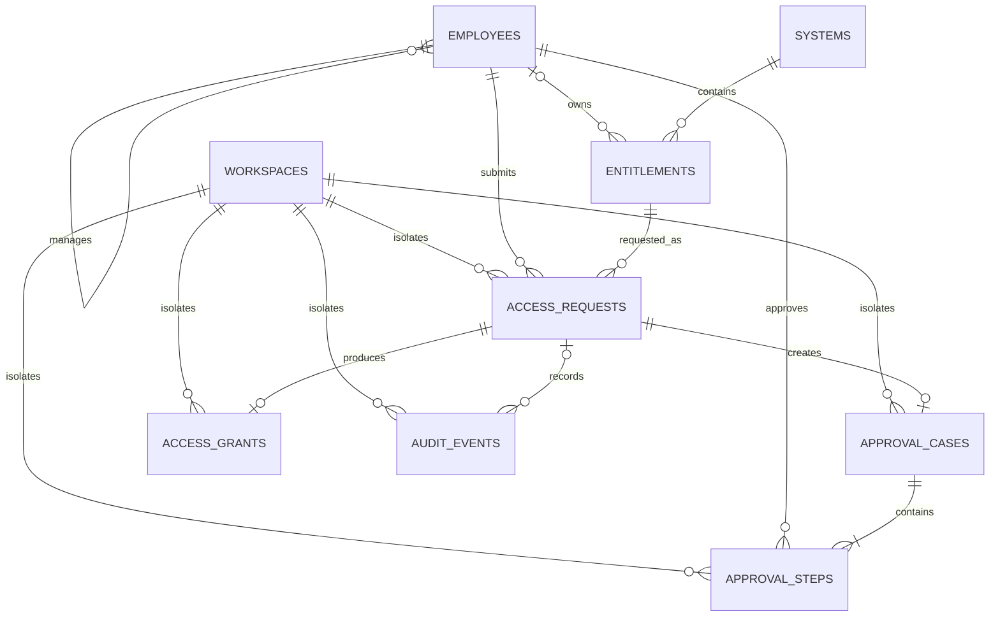

# Day 4：PostgreSQL 持久化与审计轨迹设计

## 目标

将 Day 3 的内存 Workspace 扩展为可持久化的业务数据层，为后续 Agent 工具调用、人工审批、IAM 开通、RAG 和完整审计链提供稳定基础。所有员工、系统、权限和政策数据均为原创虚构数据。

## 运行方案

本地开发使用电脑已安装的 PostgreSQL 16，在仓库的 `postgres-data/` 中运行 AccessPilot 专用数据库集群，端口为 `55432`。数据目录已被 Git 忽略，不会提交业务数据。数据库已启用 pgvector 0.8.1。该轻量方案用于适配旧电脑；最终腾讯云环境仍使用 Docker Compose。

后端使用 SQLAlchemy 2.0 ORM、同步 psycopg 驱动和 Alembic 迁移。首版不引入异步数据库会话，降低学习和调试复杂度。

## 模型边界

Pydantic 模型继续表达 API 和 Agent 的结构化输入输出，例如 `RequestDraft`。SQLAlchemy 模型只表达数据库表。两者不复用同一个类，避免 API 契约与持久化结构相互绑定。

数据库代码集中放在：

```text
apps/api/src/accesspilot/db/
├── base.py       # SQLAlchemy 公共基类
├── models.py     # ORM 数据表
└── session.py    # Engine 与 Session 工厂
apps/api/migrations/            # Alembic 迁移历史
```

## 数据表

- `workspaces`：保存 UUID、Token 哈希、草稿 JSONB、故障模式和创建时间。数据库不保存可直接冒用访客的原始 Cookie Token。
- `employees`：虚构员工、部门、直属经理和角色。
- `systems`：可申请权限的虚构企业系统。
- `entitlements`：最小权限单位、风险等级、审批策略、数据所有者、自助限制和最长期限。
- `access_requests`：用户确认后的正式申请，包含 Workspace、申请人、权限、项目编码、数据范围、用途、开始日期、期限、状态和确认时间。
- `approval_cases`：一份申请的整体审批流程，与申请本身分离。
- `approval_steps`：具体审批顺序、审批人、角色、决策、意见和时间。
- `access_grants`：IAM 真正开通成功后的权限，保存申请、幂等键、生效与失效时间；不以“审批通过”代替“授权成功”。
- `audit_events`：只追加的业务时间线，保存事件类型、操作者类型与标识、结构化详情和时间。
- `policy_chunks`：政策编号、分块序号、正文、元数据、512 维向量和创建时间。向量允许临时为空，便于 Embedding 失败后重试。

员工、系统、权限和政策是全局只读虚构目录。申请、审批、授权和审计数据必须关联 `workspace_id`，所有业务查询都以当前 Workspace 作为边界。

`project_code` 只是权限申请的外部业务上下文。AccessPilot 不管理项目负责人、成员、状态或生命周期，因此首版不建立 `projects` 表。

## 约束与事务

- 一份申请最多只有一个 `approval_case`。
- `(approval_case_id, step_order)` 唯一，防止重复审批层级。
- `access_grants.request_id` 和 `idempotency_key` 均唯一，防止 IAM 重试产生重复权限。
- 子表使用 `(workspace_id, request_id)` 或 `(workspace_id, approval_case_id)` 组合外键，保证业务记录与其父记录属于同一 Workspace。
- 外键限制孤立记录；目录数据默认不级联删除。
- 时间使用带时区时间戳，稳定编号使用唯一字符串，业务记录使用 UUID。

`access_requests`、`approval_cases` 和 `approval_steps` 分别使用 `request_status`、`approval_status` 和 `step_status`，避免联表查询时混淆不同实体的状态。`access_grants` 不重复保存申请人和权限编码，因为它们可通过唯一 `request_id` 从不可随意修改的正式申请中获取。

`audit_events.request_id` 允许为空，以表达 `workspace.reset` 等 Workspace 级事件。审计操作者使用 `actor_type` 区分 `employee`、`agent` 和 `system`，`actor_id` 在系统自动事件中可为空。

## 关系总览

> 包含各表关键字段、主外键和唯一约束的版本，请查看 [AccessPilot 数据库 ER 图](../../architecture/data-model-er.md)。



`POLICY_CHUNKS` 是全局只读 RAG 资料，不直接依赖 Workspace 或申请。风险审查产生的政策引用将在后续 Agent/Risk Review 模型中表达。

用户确认提交时，创建 `access_request`、`approval_case`、必需的 `approval_steps` 和首条 `audit_event` 必须位于同一数据库事务。任一步失败时整体回滚，不保留半成品。

## 错误处理

Service 层捕获并翻译数据库唯一约束、外键和连接失败，每次失败后显式回滚 Session。RAG 分块缺少向量时不得返回伪造的政策引用；应进入可重试错误。

## 验证方案

1. Alembic 能从空数据库升级到最新版本。
2. 虚构种子数据可重复加载，不产生重复目录。
3. 一个 Session 写入申请和审计记录并关闭后，新 Session 仍能读取。
4. 重启 FastAPI 后数据仍存在。
5. pytest、Ruff 和 MyPy 全部通过后，才勾选 Day 4 相应检查点。
